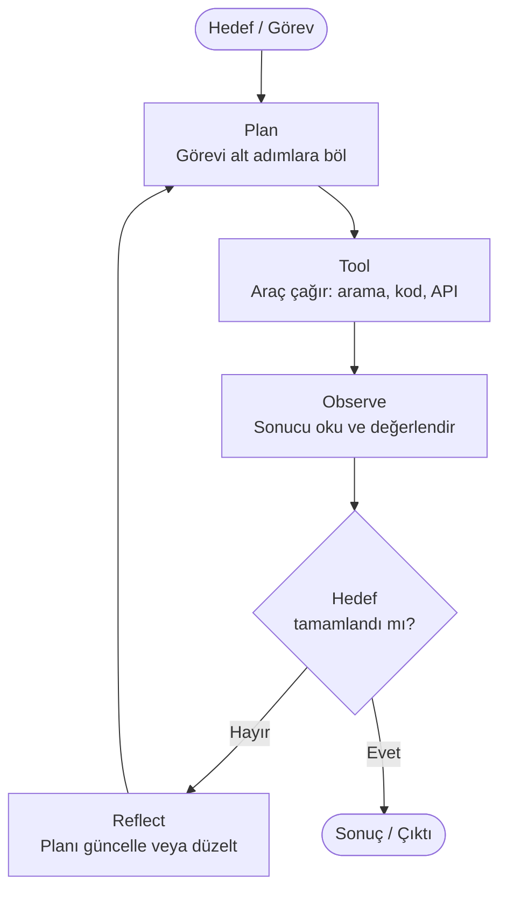

## Tek Paragraf Tanım

**Agentic AI** (ajantik yapay zeka), bir büyük dil modelini (LLM — Large Language Model) pasif bir soru-cevap motorundan çıkarıp; hedef verildiğinde bağımsız olarak **planlayan, araç kullanan, gözlemleyen, yansıtan ve gerektiğinde yeniden deneyen** otonom bir sisteme dönüştüren mimari yaklaşımdır. Temel bileşenler şunlardır: planlama (planning), araç kullanımı (tool use), bellek (memory), yansıma (reflection) ve doğrulama döngüsü (verification loop).

---

## LLM ile Agent Karşılaştırması

| Özellik | Saf LLM | Agentic AI |
|---|---|---|
| **Çalışma modu** | Tek seferlik istek-yanıt | Çok adımlı, döngüsel |
| **Araç kullanımı** | Hayır | Evet (web arama, kod çalıştırma, API çağrısı…) |
| **Bellek** | Yalnızca bağlam penceresi (context window) | Kısa + uzun vadeli, oturumlar arası |
| **Planlama** | Anlık yanıt üretimi | Görevi alt adımlara böler, sırayla yürütür |
| **Hata düzeltme** | Yok | Kendi çıktısını eleştirir, yeniden dener |
| **Dış dünyayla etkileşim** | Yok | Dosya, veritabanı, API, tarayıcı… |
| **Otonomi** | Sıfır | Yüksek (insan denetimi ayarlanabilir) |
| **Örnek araç** | ChatGPT (sohbet modu) | Claude Code, LangGraph agent, CrewAI |

---

## Minimal Agent Döngüsü

Bir agent şu dörtlü döngüyü tekrar eder:

**Plan:** "Bu görevi nasıl çözerim? Hangi adımları atmalıyım?"  
**Tool:** Bir araç çağrısı yap — web'de ara, Python çalıştır, veritabanı sorgula.  
**Observe:** Araçtan gelen yanıtı işle.  
**Reflect:** "İstediğim sonuca ulaştım mı? Hayırsa ne değiştirmeliyim?"

---

## 3 Somut "Öncesi — Sonrası" Örnek

### 1. Araştırma Raporu Hazırlama

| | Saf LLM | Agentic AI |
|---|---|---|
| **Öncesi** | "Elektrikli araçlar hakkında bir özet yaz" → Hafızasındaki verilerle yanıt üretir, eski bilgi, kaynak yok | — |
| **Sonrası** | — | Agent: plan yapar → güncel kaynakları web'de arar → makaleleri okur → özeti yazar → kaynak listesi ekler → kendi yazdığını doğruluk için kontrol eder |

### 2. Kod Hata Ayıklama

| | Saf LLM | Agentic AI |
|---|---|---|
| **Öncesi** | Kodu yapıştır → "Muhtemelen şu satırda hata var" der, test etmez | — |
| **Sonrası** | — | Agent: kodu çalıştırır → hata mesajını okur → düzeltme yapar → tekrar çalıştırır → testlerin geçtiğini doğrular → commit atar |

### 3. Takvim ve E-posta Yönetimi

| | Saf LLM | Agentic AI |
|---|---|---|
| **Öncesi** | "Toplantı ayarlamam gerekiyor" → Genel öneriler verir, takvime bakmaz | — |
| **Sonrası** | — | Agent: takvimi okur → katılımcıların müsaitliğini kontrol eder → uygun zaman dilimine toplantı ekler → e-posta daveti gönderir → onay gelince günceller |

---

## 5 Dakikada Anlama Testi

Aşağıdaki 5 soruyu yanıtlamaya çalış, ardından cevabı aç.

**Soru 1:** Bir saf LLM ile bir agent arasındaki en temel fark nedir?

Cevap

Saf LLM tek bir istek-yanıt döngüsünde çalışır; dış araçlara erişemez ve kendi hatalarını düzeltemez. Agent ise çok adımlı bir döngü içinde çalışır: planlar, araç kullanır, sonucu gözlemler ve gerektiğinde planını değiştirerek tekrar dener. Otonomi ve araç kullanımı agent'ı LLM'den ayıran en temel özelliklerdir.

---

**Soru 2:** Agent döngüsündeki "Reflect" (yansıma) adımı ne işe yarar?

Cevap

Reflect adımında agent, bir önceki araç çağrısından gelen sonucu değerlendirir ve hedefine ulaşıp ulaşmadığını sorgular. Hedefe ulaşılmadıysa planı günceller, farklı bir araç dener ya da yaklaşımını tamamen değiştirir. Bu adım sayesinde agent, insan müdahalesi olmadan hataları kendi kendine düzeltebilir.

---

**Soru 3:** "Bellek" (memory) agent için neden kritiktir?

Cevap

Saf LLM yalnızca mevcut bağlam penceresini (context window) kullanır; bir sonraki oturumda her şeyi unutur. Agent ise kısa vadeli bellek (çalışma sırasında), uzun vadeli bellek (vektör depolama gibi kalıcı depolar) ve oturumlar arası epizodik bellek kullanabilir. Bu sayede agent, geçmiş deneyimlerinden öğrenir ve tutarlı bir şekilde görevlere devam edebilir.

---

**Soru 4:** Neden bazı sistemlerde "Human-in-the-loop" (döngüde insan) tasarımı tercih edilir?

Cevap

Yüksek riskli ya da geri alınamaz eylemler içeren görevlerde (örn. para transferi, e-posta gönderme, kod deploy etme) agent tamamen otonom bırakılırsa hatalı kararlar büyük zarara yol açabilir. Human-in-the-loop tasarımında agent kritik adımlara geldiğinde durur, insandan onay ister ve ancak onayın ardından devam eder. Bu denge otonomi ile güvenlik arasındaki en yaygın çözümdür.

---

**Soru 5:** Multi-agent (çok ajanlı) sistem neden tek bir büyük agent'tan daha verimli olabilir?

Cevap

Tek bir büyük agent tüm görevi sırayla işlemek zorundadır ve bağlam penceresi dolabilir. Multi-agent sistemlerde görevler uzmanlaşmış alt agentlara (worker) dağıtılır; bunlar paralel çalışabilir. Ayrıca her alt agent farklı ve daha ucuz bir model kullanabilir — örneğin gözden geçirme için Sonnet, basit kontrol için Haiku. Bu hem hız hem de maliyet açısından avantaj sağlar.

---

## Sonraki Adım

Temel tanımı anladıktan sonra agentic AI'yi oluşturan ana kavramları inceleyelim:

[Temel Kavramlara Git →](/baslangic/temel-kavramlar)
