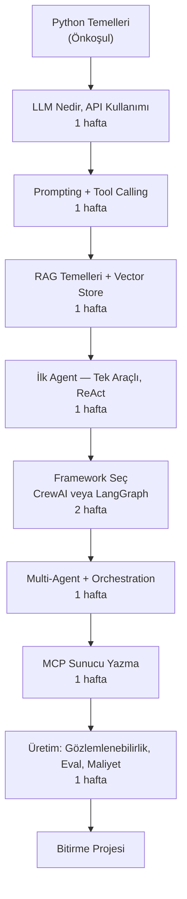

## Neden Bir Öğrenme Yoluna İhtiyacınız Var?

Agentic AI ekosistemi 2026 itibarıyla son derece geniş: onlarca framework, protokol, araç ve pattern. Neyi önce öğreneceğinizi bilmezseniz "her şeyi biraz" öğrenip hiçbirinde derinleşemezsiniz.

Bu öğrenme yolu, **birikimli ilerleme** ilkesiyle tasarlandı: her adım bir öncekinin üzerine inşa edilir. Sırayla gitmeniz önerilir; ancak belirli bir konuya hakim olduğunuzu düşünüyorsanız o adımı atlayabilirsiniz.

**Toplam tahmini süre:** 9-10 hafta (haftada 5-8 saat aktif çalışma).

---

## Öğrenme Yolu Haritası

---

## Aşama 1 — Python Temelleri (Önkoşul)

**Süre:** Kendi hızınıza göre (bu sitede ele alınmıyor).

Agentic AI kodu yazmak için Python'da aşağıdakileri bilmeniz yeterli:

- Fonksiyonlar, sınıflar, modüller.
- `pip` ile paket yönetimi, sanal ortam (`venv` veya `conda`).
- `requests` veya `httpx` ile API çağrısı.
- Temel JSON işleme.

<Callout type="ipucu">
Python'a yeniyseniz [Real Python](https://realpython.com/) veya resmi Python belgesi iyi başlangıç noktalarıdır. Bu sitedeki örneklerin tamamı Python 3.10+ ile çalışır.
</Callout>

---

## Aşama 2 — LLM Nedir, API Kullanımı (1 Hafta)

**Hedefler:**
- Büyük dil modelinin (LLM — Large Language Model) nasıl çalıştığını kavramak.
- Anthropic veya OpenAI API'si üzerinden ilk metin üretimini gerçekleştirmek.
- Token (token), istem (prompt) ve tamamlama (completion) kavramlarını içselleştirmek.

**Kaynaklar:**
- [Agentic AI Nedir?](/baslangic/agentic-ai-nedir)
- [Modül 01 — Temeller](/modul/01-temeller)

---

## Aşama 3 — Prompting ve Tool Calling (1 Hafta)

**Hedefler:**
- Sistem istemi (system prompt) yazma stratejileri.
- Fonksiyon çağırma (function calling) mekanizmasını anlamak.
- Araç şeması (tool schema) tanımlamak ve araç sonuçlarını döngüye beslemek.

**Kaynaklar:**
- [Tool Use](/kavramlar/tool-use)
- [Function Calling](/kavramlar/function-calling)
- [Modül 02 — İlk Tool Calling](/modul/02-ilk-tool-calling)

---

## Aşama 4 — RAG Temelleri ve Vector Store (1 Hafta)

**Hedefler:**
- Erişim destekli üretimi (RAG — Retrieval-Augmented Generation) uygulamak.
- Gömme vektörü (embedding) üretmek ve bir vektör deposuna (vector store) kaydetmek.
- Basit bir belge soru-cevap sistemi kurmak.

**Kaynaklar:**
- [RAG ve Agentic RAG](/kavramlar/rag-ve-agentic-rag)
- [Modül 03 — RAG Kurulumu](/modul/03-rag-kurulumu)

---

## Aşama 5 — İlk Agent, Tek Araçlı, ReAct (1 Hafta)

**Hedefler:**
- ReAct döngüsünü sıfırdan uygulamak.
- Araç çağırma → gözlem → planlama → tekrar döngüsünü yönetmek.
- Agent'ın nasıl "düşündüğünü" anlamak.

**Kaynaklar:**
- [İlk Agent'ını Kur](/baslangic/ilk-agent)
- [Modül 02 — İlk Tool Calling](/modul/02-ilk-tool-calling)

<Callout type="info">
Bu aşamayı tamamladığınızda "Agentic AI yapıyorum" diyebilirsiniz. Bir framework kullanmadan saf Python'la agent yazmak, framework'lerin içini anlamak için kritik öneme sahiptir.
</Callout>

---

## Aşama 6 — Framework Seçimi: CrewAI veya LangGraph (2 Hafta)

Bu aşamada bir framework seçip derinleşmeye başlıyorsunuz. İkisini de yüzeysel bilmek yerine birini iyi bilmek çok daha değerlidir.

### Hangisini Seçmeliyim?

| Durum | Öneri |
|---|---|
| Hızlı prototip, rol tabanlı (araştırmacı, yazar, editör) | **CrewAI** |
| Üretim, denetlenebilir durum (state), karmaşık akış | **LangGraph** |
| Tek geliştirici, terminal seviyorsunuz, kod odaklı | **Claude Code** |
| Bakım modunda, yeni projede kullanmayın | ~~AutoGen~~ |

**LangGraph seçtiyseniz:**
- [Modül 04 — LangGraph Başlangıç](/modul/04-langgraph-baslangic)
- [LangGraph aracı](/araclar/langgraph)

**CrewAI seçtiyseniz:**
- [Modül 05 — CrewAI Multi-Agent](/modul/05-crewai-multi-agent)
- [CrewAI aracı](/araclar/crewai)

---

## Aşama 7 — Multi-Agent ve Orkestrasyon (1 Hafta)

**Hedefler:**
- Manager-worker, group chat ve hiyerarşik pattern'leri uygulamak.
- Agent orkestrasyon (agent orchestration) ilkelerini kavramak.
- Maliyet optimizasyonu için her agent'a uygun model atamak.

**Kaynaklar:**
- [Multi-Agent Systems](/kavramlar/multi-agent-systems)
- [Agent Orchestration](/kavramlar/agent-orchestration)
- [Modül 05 — CrewAI Multi-Agent](/modul/05-crewai-multi-agent)

<Callout type="uyari">
Çok ajanlı sistemlerde maliyet hızla artar. Her agent-arası mesaj model çağrısıdır. Gözden geçirme agent'ına Claude Sonnet, basit sınıflandırma agent'ına Claude Haiku atayın.
</Callout>

---

## Aşama 8 — MCP Sunucu Yazma (1 Hafta)

**Hedefler:**
- Model Bağlam Protokolü'nü (MCP — Model Context Protocol) derinlemesine anlamak.
- Kendi MCP sunucunuzu Python ile yazmak.
- Sunucuyu Claude Code veya başka bir agent'a bağlamak.

**Kaynaklar:**
- [MCP Protokolü](/kavramlar/mcp-protokol)
- [MCP Sunucu Listesi](/entegrasyonlar/mcp-sunucu-listesi)
- [Modül 06 — MCP Sunucu Yazma](/modul/06-mcp-sunucu-yazma)

---

## Aşama 9 — Üretim: Gözlemlenebilirlik, Eval, Maliyet (1 Hafta)

**Hedefler:**
- LangSmith veya benzeri araçlarla agent izleme (tracing) kurmak.
- Değerlendirme (eval) pipeline'ı tasarlamak.
- Token harcamasını analiz etmek ve optimize etmek.
- İnsan denetim noktaları (human-in-the-loop checkpoint) eklemek.

**Kaynaklar:**
- [Human-in-the-Loop](/kavramlar/human-in-the-loop)
- [Model Context Management](/kavramlar/model-context-management)
- [Modül 07 — Claude Code Üretim](/modul/07-claude-code-uretim)
- [Modül 09 — Multi-Model Orkestrasyon](/modul/09-multi-model-orkestrasyon)

---

## Aşama 10 — Bitirme Projesi

Tüm aşamaları tamamladıktan sonra öğrendiklerinizi bir projede birleştirin. Öneriler:

**Başlangıç seviyesi:**
- PDF seti üzerinden soru-cevap agent'ı (basit RAG).
- RSS okuyup haftalık bülten üreten agent.

**Orta seviye:**
- Multi-agent içerik üretim hattı: araştırmacı + yazar + editör.
- Müşteri destek triajı + Slack yönlendirme.

**İleri seviye:**
- LangGraph ile dayanıklı, kesintiye dirençli uzun süreli görev.
- Multi-model router + maliyet optimizasyonlu üretim sistemi.

[Tüm proje fikirlerini gör →](/projeler/baslangic)

---

## Görsel Roadmap

Etkileşimli öğrenme yolu haritası ve modüller arası bağlantılar için:

[Roadmap sayfasını aç →](/roadmap)

---

## Sonraki Adım

Yolu anladınız. Şimdi ilk somut adımı atın:

[İlk Agent'ı Kur →](/baslangic/ilk-agent)
