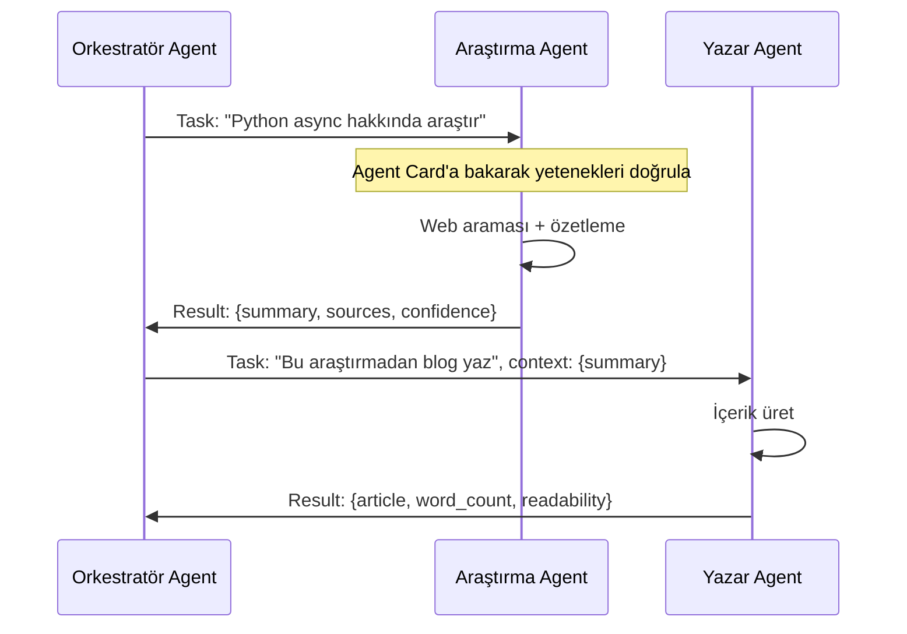

## TL;DR

A2A (Agent-to-Agent) Protokolü, farklı platformlarda veya framework'lerde çalışan agent'ların birbirini keşfetmesine ve standart mesajlarla iletişim kurmasına olanak tanır. MCP'nin araç-model bağlantısını standartlaştırması gibi, A2A agent-model bağlantısını standartlaştırır. 2026 itibarıyla ikinci büyük agent iletişim standardı olarak yükselmektedir.

## Detaylı açıklama

Çoklu agent sistemlerinde en büyük sorunlardan biri birlikte çalışabilirlik (interoperability) sorunudur: LangGraph'ta yazılmış bir agent, CrewAI agent'ıyla nasıl konuşur? Anthropic'in subagent'ları OpenAI Agents SDK'sındaki agent'larla nasıl iş birliği yapar?

A2A Protokolü bu sorunu çözmek üzere tasarlanmıştır.

### Temel kavramlar

**Agent Kimlik Kartı (Agent Card)**

Her agent kendi yeteneklerini, desteklediği görev türlerini ve iletişim endpoint'ini JSON formatında yayımlar. Diğer agent'lar bu kartı okuyarak hangi agent'a ne sorabileceğini öğrenir.

```json
{
  "agent_id": "research-agent-v2",
  "capabilities": ["web_search", "paper_summary", "fact_check"],
  "input_schema": {
    "type": "object",
    "properties": {
      "query": {"type": "string"},
      "max_sources": {"type": "integer"}
    }
  },
  "endpoint": "https://agents.example.com/research/invoke",
  "auth": "bearer_token"
}
```

**Görev Mesajı (Task Message)**

Agent'lar birbirine standart formatta görev mesajları gönderir. Mesaj içerir: görev tanımı, öncelik, beklenen çıktı formatı, zaman aşımı süresi.

**Sonuç Mesajı (Result Message)**

Yanıt veren agent standart formatta sonuç döner: çıktı, kullanılan araçlar, güven skoru, kaynak listesi.



### MCP ile ilişkisi

MCP ve A2A farklı katmanlarda çalışır ve birbirini tamamlar:

| Protokol | Bağlantı Türü | Örnek |
|---|---|---|
| **MCP** | Model ↔ Araç | Claude Code ↔ GitHub MCP sunucusu |
| **A2A** | Agent ↔ Agent | Araştırma Agent'ı ↔ Yazar Agent'ı |

Bir sistem her ikisini de kullanabilir: agent'lar kendi araçlarına MCP ile bağlanırken birbirleriyle A2A ile iletişim kurar.

<Callout type="info">
A2A Protokolü 2026 itibarıyla olgunlaşma sürecindedir. Temel spesifikasyon stabilize olmuş olsa da bazı eklentiler ve uygulamalar hâlâ gelişmektedir. Üretim sistemleri için spesifikasyon versiyonunu takip edin.
</Callout>

### Keşif Mekanizması (Discovery)

Agent'lar birbirini üç yoldan keşfedebilir:

1. **Statik yapılandırma:** Orkestratör agent listesi önceden tanımlanmış
2. **Kayıt defteri (Registry):** Merkezi bir agent kayıt servisi — agent'lar yeteneklerini kaydeder, orkestratör ihtiyaca göre bulur
3. **Dinamik keşif:** Orkestratör başka agent'lara sorarak yetenekleri öğrenir

## Minimal örnek

```python
import httpx
import asyncio
from typing import Any

# A2A uyumlu basit agent istemcisi
class A2AClient:
    def __init__(self, endpoint: str, token: str):
        self.endpoint = endpoint
        self.headers = {"Authorization": f"Bearer {token}"}

    async def get_agent_card(self) -> dict:
        async with httpx.AsyncClient() as client:
            resp = await client.get(f"{self.endpoint}/card", headers=self.headers)
            return resp.json()

    async def send_task(self, task: str, context: dict = None) -> dict:
        payload = {
            "task": task,
            "context": context or {},
            "format": "json"
        }
        async with httpx.AsyncClient() as client:
            resp = await client.post(
                f"{self.endpoint}/invoke",
                json=payload,
                headers=self.headers,
                timeout=30.0
            )
            return resp.json()

# Orkestratör: iki agent'ı koordine et
async def orchestrate():
    research = A2AClient("https://research-agent.example.com", "token-r")
    writer = A2AClient("https://writer-agent.example.com", "token-w")

    # Araştırma agent'ına görev gönder
    research_result = await research.send_task(
        task="Python async programlama nedir?",
        context={"max_sources": 5}
    )

    # Sonucu yazar agent'ına ilet
    article = await writer.send_task(
        task="Bu araştırmadan blog yazısı üret",
        context={"research": research_result.get("summary")}
    )
    return article

result = asyncio.run(orchestrate())
print(result)
```

## Gerçek dünya örneği

Büyük bir teknoloji firmasında farklı takımlar farklı framework'lerde agent'lar geliştirmiştir:
- Veri takımı: LangGraph tabanlı analiz agent'ları
- Ürün takımı: CrewAI tabanlı içerik agent'ları
- Güvenlik takımı: Özel framework'te uyumluluk agent'ı

A2A olmadan bu agent'lar yalnızca kendi takımları içinde çalışabilir. A2A ile ürün içeriği talebi geldiğinde:
1. İçerik agent'ı → veri agent'ına A2A ile soru sorar: "Bu ürünün kullanım istatistikleri nedir?"
2. İstatistikler gelir, içerik üretilir
3. Uyumluluk agent'ı → içeriği A2A ile gözden geçirir, onaylar

Takımlar kendi teknoloji seçimlerini korurken agent'lar şirket genelinde iş birliği yapabilir.

## Avantajlar / Sınırlamalar

| Avantaj | Sınırlama |
|---|---|
| Framework bağımsız agent iletişimi | Protokol hâlâ olgunlaşma sürecinde |
| Farklı takımların agent'larını entegre eder | Her agent'ın A2A uyumlu hale getirilmesi gerekir |
| Merkezi kayıt ile dinamik agent keşfi | Güven ve kimlik doğrulama karmaşıklığı |
| Büyük ölçekli agent ekosistemlerine zemin hazırlar | Hata yönetimi ve yeniden deneme protokolü tanımlanmalı |
| Yeteneklerin standart tanımı, belgeleme kolaylaşır | Orkestrasyon gecikmesi artar (ek HTTP katmanı) |

## Ne zaman kullanılır / kullanılmaz

**Kullanılır:**
- Farklı framework'lerde yazılmış agent'ları entegre edecekseniz
- Şirket genelinde paylaşılan agent servisleri oluşturuyorsanız
- Agent keşif ve yönlendirme standartlaştırılmak isteniyorsa
- Büyük ölçekli, çok takımlı agent ekosistemleri kuruyorsanız

**Kullanılmaz:**
- Tüm agent'lar aynı framework içinde çalışıyorsa (LangGraph paylaşımlı durum yeterli)
- Küçük, tek ekipli projelerde (fazla mühendislik)
- Prototipleme aşamasında (önce çalıştır, sonra standartlaştır)
- Gerçek zamanlı düşük gecikmeli sistemlerde (HTTP protokol overhead'ı)

<Callout type="ipucu">
A2A ve MCP'yi birlikte kullanmak genellikle en sağlam mimariye yol açar: agent'lar MCP ile kendi araçlarına bağlanır, A2A ile birbirleriyle iletişim kurar. Bu iki protokol rakip değil, tamamlayıcıdır.
</Callout>

## İlişkili kavramlar

- [MCP Protokol](/kavramlar/mcp-protokol) — araç-model iletişiminin standardı; A2A'yı tamamlar
- [Çoklu Agent Sistemleri (Multi-Agent Systems)](/kavramlar/multi-agent-systems) — A2A bu sistemlerin iletişim altyapısıdır
- [Agent Orkestrasyonu (Agent Orchestration)](/kavramlar/agent-orchestration) — A2A orkestratörün agent havuzunu genişletir
- [Fonksiyon Çağırma (Function Calling)](/kavramlar/function-calling) — A2A mesajları içinde araç çağrıları yer alabilir

## Daha derine

- A2A Protokol resmi spesifikasyonu ve GitHub deposu (github.com/google/A2A — referans uygulama)
- Google A2A duyurusu ve geliştirici belgeleri (developers.google.com)
- **Towards Standardized Multi-Agent Communication** — protokol tasarım motivasyonu
- OpenAI Agents SDK ile A2A entegrasyon notları (platform.openai.com)
- [Çoklu agent mimarileri](/workflow/desenler)
- [A2A sunucu listesi ve örnekler](/entegrasyonlar/mcp-sunucu-listesi)
