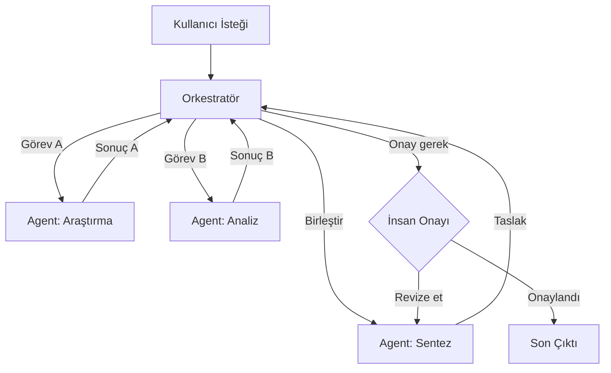

## TL;DR

Agent orkestrasyonu (agent orchestration), birden fazla agent'ı bir orkestra şefi gibi yöneten katmandır: hangi agent ne zaman çalışır, agent'lar birbirleriyle nasıl haberleşir ve hata durumunda sistem nasıl tepki verir. LangGraph bu alanın üretim için fiili standardı haline gelmiştir.

## Detaylı açıklama

Çoklu agent sistemlerini inşa etmek yeterli değildir; bu agent'ları koordine eden bir yapıya ihtiyaç duyulur. Orkestrasyon katmanı bu görevi üstlenir.

### Orkestrasyonun temel sorumlulukları

1. **Görev yönlendirme (Routing):** Gelen görevi en uygun agent'a atama
2. **Durum yönetimi (State Management):** Agent'lar arasında paylaşılan bilginin tutulması
3. **Bağımlılık çözümü (Dependency Resolution):** B agent'ı A'nın çıktısına muhtaçsa, A önce çalışır
4. **Hata yönetimi (Error Handling):** Bir agent başarısız olursa sistemi tutarlı tutma
5. **Paralel yürütme (Parallel Execution):** Bağımsız agent'ları aynı anda çalıştırma
6. **Gözlemlenebilirlik (Observability):** Her agent'ın ne yaptığını izleme ve kayıt

### Orkestrasyon stratejileri

**Merkezi Orkestrasyon**

Tek bir orkestratör agent tüm kararları verir. Anlaşılması ve hata ayıklaması kolaydır; ancak orkestratör darboğaz haline gelebilir.

**Dağıtık Orkestrasyon**

Agent'lar birbirleriyle doğrudan iletişim kurar; merkezi kontrol yoktur. Ölçeklenir ancak koordinasyonu karmaşıklaşır. A2A protokolü bu yaklaşımı standartlaştırır.

**Hibrit Orkestrasyon**

Üst seviye orkestratör + yerel self-coordination. LangGraph'ın çoklu graf (subgraph) desteği bunu mümkün kılar.



### LangGraph ile orkestrasyon

LangGraph, orkestrasyonu yönlü asiklik grafikler (DAG — Directed Acyclic Graph) olarak modeller. Her düğüm (node) bir agent veya fonksiyon, her kenar (edge) bir geçiş koşuludur. Temel avantajları:

- **Kalıcı durum (Persistent State):** Checkpoint mekanizmasıyla agent durumu kaydedilir; hata veya kesintide kaldığı yerden devam eder
- **Koşullu kenarlar (Conditional Edges):** Agent çıktısına göre farklı yollara dallanma
- **LangSmith entegrasyonu:** Her adımın izlenmesi ve hata ayıklaması
- **İnsan onay noktaları:** Grafikteki herhangi bir noktada insan müdahalesi

<Callout type="uyari">
**Maliyet disiplini:** Orkestrasyon katmanının kendisi de model çağrısı yapar. Orkestratörün her kararı bir API çağrısıdır. Kural tabanlı yönlendirme (basit if/else) mümkünse, pahalı bir LLM router yerine deterministik mantığı tercih edin.
</Callout>

### Orkestratör model seçimi

| Rol | Önerilen Model | Gerekçe |
|---|---|---|
| Orkestratör | Claude Sonnet / GPT-4o mini | Akıl yürütme + orta maliyet |
| Araştırma Worker | Haiku / GPT-4o mini | Bilgi getirme, düşük maliyet |
| Analiz Worker | Sonnet | Orta karmaşıklık, dengeli maliyet |
| Kod Üretimi | Sonnet / Opus | Kalite kritik |
| Eleştirmen / Değerlendirici | Haiku | Rubrik kontrolü, ucuz |

## Minimal örnek

```python
from langgraph.graph import StateGraph, END
from typing import TypedDict, Annotated
import operator

class AgentState(TypedDict):
    task: str
    research: str
    draft: str
    messages: Annotated[list, operator.add]

def research_node(state: AgentState) -> AgentState:
    # Araştırma agent'ı (Haiku — ucuz)
    result = f"Araştırma: {state['task']} hakkında temel bilgiler toplandı."
    return {"research": result, "messages": ["research_done"]}

def writer_node(state: AgentState) -> AgentState:
    # Yazar agent'ı (Sonnet)
    draft = f"Taslak: {state['research']} temel alınarak yazıldı."
    return {"draft": draft, "messages": ["draft_done"]}

def should_revise(state: AgentState) -> str:
    # Koşullu kenar: taslak yeterince uzunsa bitir
    return "end" if len(state.get("draft", "")) > 50 else "writer"

workflow = StateGraph(AgentState)
workflow.add_node("researcher", research_node)
workflow.add_node("writer", writer_node)
workflow.set_entry_point("researcher")
workflow.add_edge("researcher", "writer")
workflow.add_conditional_edges("writer", should_revise, {"end": END, "writer": "writer"})

app = workflow.compile()
result = app.invoke({"task": "Python async programlama", "messages": []})
print(result["draft"])
```

## Gerçek dünya örneği

BlackRock ve JPMorgan gibi finans kurumları LangGraph tabanlı orkestrasyon sistemleri kullanmaktadır. Tipik bir senaryo:

1. **Veri toplama agent'ı:** Borsa verisi, haberler, şirket raporları toplar
2. **Risk analiz agent'ı:** Portföy riskini hesaplar
3. **Öneri agent'ı:** Analiz sonucuna göre işlem önerisi üretir
4. **Uyumluluk agent'ı:** Öneri regülasyonlara uygun mu kontrol eder
5. **İnsan onay noktası:** Kritik işlemler insan analistin onayını bekler

Tüm bu akış LangGraph grafiğinde tanımlanır; LangSmith her adımı izler ve denetim izi (audit trail) oluşturur.

## Avantajlar / Sınırlamalar

| Avantaj | Sınırlama |
|---|---|
| Karmaşık iş akışları görsel ve yönetilebilir hale gelir | Öğrenme eğrisi yüksektir |
| Checkpoint ile kesintiye dayanıklı sistemler | Orkestrasyon katmanı ek gecikme ekler |
| Gözlemlenebilirlik ve denetim kolaylaşır | Fazla mühendislik (over-engineering) riski |
| Koşullu dallanma ve hata yönetimi standart | Her düğüm bağımsız test gerektirir |
| Paralel yürütme ile hız optimizasyonu | Durum yönetimi karmaşıklaşabilir |

## Ne zaman kullanılır / kullanılmaz

**Kullanılır:**
- Çok adımlı, bağımlı iş akışları varsa
- Kesintiye dayanıklılık (checkpoint) gerekiyorsa
- Farklı roller ve modeller içeren sistemler kuruyorsanız
- Gözlemlenebilirlik ve denetim zorunluysa (regülasyonlu sektörler)

**Kullanılmaz:**
- Tek agent veya basit zincir yeterliyse
- Hızlı prototipleme aşamasındasınız (önce CrewAI deneyin)
- İş akışı her çalıştırmada tamamen değişiyorsa
- Takımda LangGraph veya benzeri araç deneyimi yoksa

<Callout type="ipucu">
Prototip için CrewAI, üretim için LangGraph tercih edin. CrewAI'da çalışan bir konsepti LangGraph'a taşımak zaman alır ama üretim dayanıklılığı ve gözlemlenebilirlik açısından değer.
</Callout>

## İlişkili kavramlar

- [Çoklu Agent Sistemleri (Multi-Agent Systems)](/kavramlar/multi-agent-systems) — orkestrasyon bu sistemlerin koordinasyon katmanıdır
- [Planlama (Planning)](/kavramlar/planning) — orkestratörün görev dağılımı stratejisi
- [İnsanlı Döngü (Human-in-the-Loop)](/kavramlar/human-in-the-loop) — orkestrasyon grafiğindeki insan onay noktaları
- [MCP Protokol](/kavramlar/mcp-protokol) — agent'ların araçlara standart erişimi
- [A2A Protokol](/kavramlar/a2a-protokol) — agent'lar arası standart iletişim

## Daha derine

- LangGraph resmi dokümantasyonu (python.langchain.com/docs/langgraph)
- LangSmith gözlemlenebilirlik rehberi (docs.smith.langchain.com)
- **MetaGPT** (Hong et al., 2023) — yazılım geliştirme için çok-agent orkestrasyon
- Anthropic multi-agent mimari rehberi (docs.anthropic.com/agents)
- [LangGraph aracı sayfası](/araclar/langgraph)
- [Workflow desenleri](/workflow/desenler) — orkestrasyon desenlerinin kapsamlı kataloğu
- [Multi-model stratejileri](/workflow/multi-model-stratejileri) — model seçimi ve maliyet optimizasyonu
