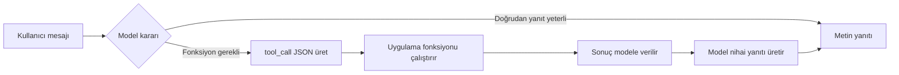

## TL;DR

Fonksiyon çağırma (function calling), bir LLM'in serbest metin yerine belirli bir JSON şemasına uyan yapılandırılmış çıktı üretmesidir. Bu çıktı uygulamanın gerçek bir fonksiyonu çalıştırmasına ve sonucu modele geri vermesine olanak tanır. OpenAI'nın 2023'te popülerleştirdiği bu terim, Anthropic'te "araç kullanımı (tool use)" adıyla karşılık bulur.

## Detaylı açıklama

Geleneksel bir LLM çağrısında model yalnızca metin üretir. Fonksiyon çağırma, modele "metin üretmek yerine şu formatta bir fonksiyon çağrısı üret" talimatını veren özel bir API modudur.

Temel bileşenler:

**1. Fonksiyon tanımı (Function Definition)**

Geliştirici, modele kullanabileceği fonksiyonları JSON Şeması (JSON Schema) standardıyla tanımlar:

```json
{
  "name": "search_database",
  "description": "Ürün veritabanında arama yapar",
  "parameters": {
    "type": "object",
    "properties": {
      "query": {
        "type": "string",
        "description": "Arama terimi"
      },
      "max_results": {
        "type": "integer",
        "description": "Maksimum sonuç sayısı",
        "default": 10
      }
    },
    "required": ["query"]
  }
}
```

**2. Model kararı (Model Decision)**

Model mesajı ve fonksiyon listesini değerlendirir. Fonksiyon çağrısı gerekiyorsa `finish_reason: "tool_calls"` döner.

**3. Paralel çağrı (Parallel Calling)**

Modern modeller (GPT-4o, Claude 3.5+) tek turda birden fazla fonksiyon çağrısı üretebilir; bu durum gecikmeyi önemli ölçüde azaltır.



<Callout type="uyari">
Fonksiyon tanımları context penceresini tüketir. 20+ fonksiyon tanımladığınızda token maliyeti belirgin şekilde artar. Yalnızca o görev için gerekli fonksiyonları context'e ekleyin.
</Callout>

## Minimal örnek

```python
from openai import OpenAI
import json

client = OpenAI()

def get_product_price(product_id: str) -> dict:
    prices = {"P001": 299.90, "P002": 149.50}
    return {"product_id": product_id, "price": prices.get(product_id, 0)}

tools = [{
    "type": "function",
    "function": {
        "name": "get_product_price",
        "description": "Ürün fiyatını sorgular",
        "parameters": {
            "type": "object",
            "properties": {
                "product_id": {"type": "string", "description": "Ürün kodu"}
            },
            "required": ["product_id"]
        }
    }
}]

messages = [{"role": "user", "content": "P001 ürününün fiyatı nedir?"}]
response = client.chat.completions.create(
    model="gpt-4o", messages=messages, tools=tools
)

tool_call = response.choices[0].message.tool_calls[0]
result = get_product_price(**json.loads(tool_call.function.arguments))
print(f"Fiyat: {result['price']} TL")
```

## Gerçek dünya örneği

Bir e-ticaret asistanı şu fonksiyonlarla donatılabilir: `search_products`, `get_inventory`, `create_order`, `get_shipping_status`. Kullanıcı "Mavi XL beden kapüşonlu kazak var mı, varsa sipariş ver" dediğinde model otomatik olarak önce `search_products`, ardından `get_inventory`, son olarak `create_order` fonksiyonlarını doğru parametrelerle sırayla çağırır. Bu, doğrusal bir konuşmayı çok adımlı bir iş akışına dönüştürür.

## Avantajlar / Sınırlamalar

| Avantaj | Sınırlama |
|---|---|
| Yapılandırılmış, doğrulanabilir çıktı garantisi | Fonksiyon tanımları token tüketir |
| Paralel çağrı desteğiyle düşük gecikme | Model yanlış fonksiyon seçebilir ("hallucination") |
| JSON Şeması ile tip güvenliği | Karmaşık şemalar modeli yanıltabilir |
| Tüm büyük LLM sağlayıcıları destekler | Fonksiyon sayısı arttıkça seçim doğruluğu düşebilir |
| Determinizm: aynı girdi → tutarlı çağrı yapısı | Çağrı döngüsü yönetimi uygulama katmanına düşer |

## Ne zaman kullanılır / kullanılmaz

**Kullanılır:**
- Modelin belirli bir veriyi alıp işlemesi gerektiğinde
- Harici sistemle entegrasyon zorunluysa (API, veritabanı, servis)
- Modelin çıktısının makine tarafından işlenmesi gerektiğinde
- Birden fazla adım zincirlenerek görev tamamlanacaksa

**Kullanılmaz:**
- Yalnızca metin üretimi yeterliyse (gereksiz karmaşıklık ekler)
- Fonksiyon sonuçları güvenilmezse modeli yanıltır
- Çok sayıda fonksiyon context'i tüketip kaliteyi düşürüyorsa
- Gecikme kritiği ve her API turu kabul edilemezse

<Callout type="ipucu">
Fonksiyon açıklamaları (description alanları) ne kadar ayrıntılı ve net olursa model o kadar doğru seçim yapar. "Ürün sorgular" yerine "Aktif katalogdaki ürünleri SKU veya isme göre sorgular, stok durumunu içerir" yazın.
</Callout>

## İlişkili kavramlar

- [Araç Kullanımı (Tool Use)](/kavramlar/tool-use) — fonksiyon çağırmanın üst kavramı, aynı mekanizmanın farklı adı
- [MCP Protokol](/kavramlar/mcp-protokol) — fonksiyonları/araçları standart şekilde keşfeden ve yayan protokol
- [Planlama (Planning)](/kavramlar/planning) — hangi fonksiyonun hangi sırayla çağrılacağına karar verme
- [Model Bağlam Yönetimi (Model Context Management)](/kavramlar/model-context-management) — fonksiyon tanımlarının token maliyeti yönetimi

## Daha derine

- OpenAI Function Calling kılavuzu ve Cookbook (platform.openai.com)
- Anthropic Tool Use referansı (docs.anthropic.com)
- Google Gemini Function Calling dokümantasyonu (ai.google.dev)
- **Toolformer** (Schick et al., 2023) — modellerin API çağrısını kendi kendine öğrenmesi
- **AnyTool** (Du et al., 2024) — büyük ölçekli fonksiyon seçimi ve çağrı optimizasyonu
- **ToolBench** (Qin et al., 2023) — gerçek dünya API'larıyla LLM araç kullanımı benchmark'ı
