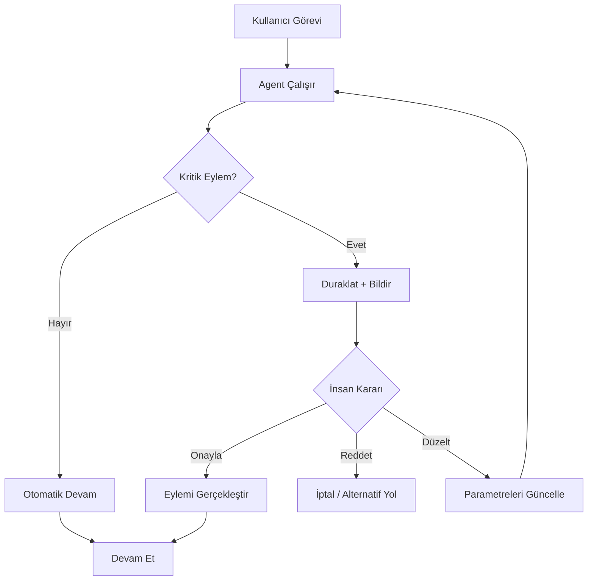

## TL;DR

İnsanlı döngü (Human-in-the-Loop — HITL), agent akışının belirli bir noktasında otomatik ilerlemeyi durdurarak bir insanın onay vermesini, düzeltme yapmasını veya yön belirlemesini gerektiren mekanizmadır. Tam otonom sistemlerde bile kritik veya geri alınamaz eylemlerde HITL zorunlu güvenlik katmanıdır.

## Detaylı açıklama

Agent otomasyonunun arttığı dünyada "ne zaman insanı döngüde tutmalıyım?" sorusu kritik bir tasarım kararı haline gelmiştir. HITL bu soruya sistematik bir yanıt verir.

### HITL'ın üç ana formu

**1. Onay Kapısı (Approval Gate)**

Agent bir eylemi gerçekleştirmeden önce insan onayı bekler. Eylemin geri alınamaz veya yüksek riskli olduğu durumlarda kullanılır.

Örnekler: veritabanı silme, finansal işlem, e-posta gönderme, kod deployment

**2. Yön Belirleme (Clarification Request)**

Agent belirsiz veya yetersiz bilgiyle karşılaştığında ilerlemek yerine insana soru sorar. Bu, "halüsinasyon ile tahminin ötesine geçme" tercihidir.

**3. Kalite Kontrol (Quality Review)**

Agent görevi tamamlar, sonucu sunar; insan değerlendirip "onayla/düzelt" kararı verir. İçerik üretimi ve kod yazımında yaygındır.



### Hangi eylemlerde HITL zorunlu?

Geri alınamaz veya yüksek etkili eylemler için HITL zorunludur:

- **Veri silme / üzerine yazma**
- **Para transferi veya ödeme**
- **Toplu e-posta gönderme**
- **Üretim ortamı deployment**
- **Harici API'ya yazma (CRM, ERP güncelleme)**
- **Hukuki veya uyumluluk belgesi imzalama**

Düşük riskli, geri alınabilir eylemler için HITL akışı yavaşlatır ve değer katmaz.

### HITL tasarım ilkeleri

**Görevleri net sınıflandırın:** Hangi eylemler otomatik, hangileri onay gerektirir? Bu listeyi belgelenmiş bir politika olarak saklayın.

**Zaman aşımı (Timeout) ekleyin:** İnsan yanıt vermezse sistem ne yapar? Güvenli varsayılan (fail-safe) tanımlayın.

**Bağlamı zengin tutun:** İnsana "Bunu onayla" yerine "Agent şu veriyi silmek istiyor: [detaylar]. Onayla mı?" sunun.

**Asenkron bildirim:** İnsan gerçek zamanlı sistemin başında beklemek zorunda kalmamalı. Slack bildirimi, e-posta veya dashboard ile uyarılabilmeli.

<Callout type="info">
Google Antigravity'nin "Co-Pilot" modu HITL'ın pratikte nasıl çalıştığının iyi örneğidir: agent önerir, geliştirici onaylar. Tam otonom "Agent Mode"da ise bağımsız çalışır; ancak kullanıcı istediği zaman müdahale edebilir.
</Callout>

## Minimal örnek

```python
from anthropic import Anthropic

client = Anthropic()

RISKY_ACTIONS = ["delete", "send_email", "deploy", "transfer"]

def is_risky(action: str) -> bool:
    return any(r in action.lower() for r in RISKY_ACTIONS)

def get_human_approval(action: str, params: dict) -> bool:
    print(f"\n[HITL] Agent şunu yapmak istiyor: {action}")
    print(f"Parametreler: {params}")
    response = input("Onayla? (e/h): ").strip().lower()
    return response == "e"

def execute_action(action: str, params: dict) -> str:
    if is_risky(action):
        if not get_human_approval(action, params):
            return f"Eylem iptal edildi: {action}"
    # Gerçek eylem burada çalışır
    return f"Eylem tamamlandı: {action}({params})"

# Simülasyon
print(execute_action("web_search", {"query": "Python docs"}))
print(execute_action("delete_file", {"path": "/data/users.csv"}))
```

## Gerçek dünya örneği

Bir hukuk firmasının sözleşme inceleme agent'ı:

1. Agent yüzlerce sözleşmeyi tarar, riskli maddeleri işaretler (otomatik)
2. Her riskli madde için "kabul et / reddet / düzelt" seçenekleri avukata sunulur (HITL)
3. Avukat onay verirse agent karşı tarafla müzakere metnini hazırlar (otomatik)
4. Nihai sözleşme imzalanmadan önce son insan onayı alınır (HITL)

Bu yapıda agent avukatın verimliliğini 10 kat artırırken kritik kararlar insan kontrolünde kalır.

## Avantajlar / Sınırlamalar

| Avantaj | Sınırlama |
|---|---|
| Geri alınamaz hatalar önlenir | İnsan yanıtı beklenerek otomasyon yavaşlar |
| Güven ve hesap verebilirlik artar | HITL noktaları kötü tasarlanırsa "onay yorgunluğu" oluşur |
| Yasal ve uyumluluk gereksinimlerini karşılar | Asenkron tasarım gerektiren ek mühendislik |
| Kullanıcı agent'ın kararlarını öğrenir ve düzeltir | Çok sık HITL otomasyonun değerini yok eder |
| Belirsiz durumlar güvenle yönetilir | İnsan çevrimdışıysa sistem bloke olur |

## Ne zaman kullanılır / kullanılmaz

**Kullanılır:**
- Geri alınamaz veya yüksek etkili eylemler söz konusuysa
- Regülasyonlu sektörler (finans, sağlık, hukuk)
- Agent güven skorunun düşük olduğu yeni sistemlerde
- Kullanıcı güveni henüz kazanılmamışsa

**Kullanılmaz:**
- Düşük riskli, geri alınabilir eylemlerde (gereksiz yavaşlatma)
- Gerçek zamanlı yüksek hızlı otomasyon gereksiniminde
- İnsan onayı süreç hızını kabul edilemez biçimde düşürüyorsa
- Agent yeterince olgunlaşmış ve hata oranı çok düşükse

<Callout type="uyari">
"Onay yorgunluğu (approval fatigue)" gerçek bir risktir. Çok fazla HITL noktası koyarsanız insanlar gelen her onay isteğini okumadan onaylama alışkanlığı edinir; bu da HITL'ı işlevsiz kılar. Yalnızca gerçekten kritik noktalara koyun.
</Callout>

## İlişkili kavramlar

- [Agent Orkestrasyonu (Agent Orchestration)](/kavramlar/agent-orchestration) — HITL noktaları orkestrasyon grafiğine yerleştirilir
- [Yansıma (Reflection)](/kavramlar/reflection) — otomatik değerlendirme HITL'ı tamamlar
- [Çoklu Agent Sistemleri (Multi-Agent Systems)](/kavramlar/multi-agent-systems) — MAS'ta hangi agent kararları HITL gerektirir?
- [Planlama (Planning)](/kavramlar/planning) — plan adımları riske göre HITL ile işaretlenebilir

## Daha derine

- Anthropic "Responsible Scaling Policy" ve agent güvenlik rehberi (anthropic.com)
- LangGraph interrupt ve human-in-the-loop dokümantasyonu (python.langchain.com)
- **Constitutional AI: Harmlessness from AI Feedback** (Bai et al., 2022)
- **RLHF: Learning to summarize from human feedback** (Stiennon et al., 2020) — HITL'ın eğitim boyutu
- OpenAI Agents SDK interrupt mekanizması (platform.openai.com/docs/agents)
- [Workflow desenleri: HITL checkpoint](/workflow/desenler)
