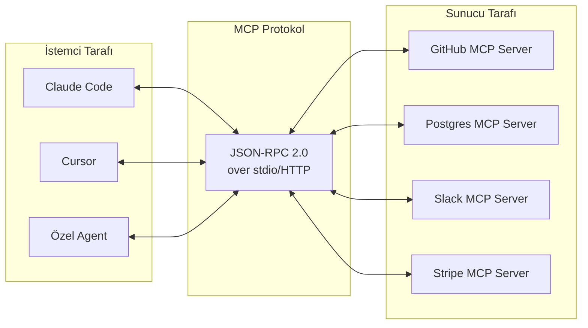

## TL;DR

MCP (Model Context Protocol — Model Bağlam Protokolü), bir LLM'in herhangi bir harici araca veya veri kaynağına standart bir arayüzle bağlanmasını sağlar. Anthropic'in 2024 sonunda açık kaynak olarak yayımladığı bu protokol; OpenAI, Google ve 200'den fazla topluluk sunucusu tarafından benimsenmiş, 2026 itibarıyla fiili sektör standardı haline gelmiştir.

## Detaylı açıklama

MCP öncesinde her araç entegrasyonu özel (custom) bir bağlayıcı gerektiriyordu: GitHub için özel kod, Slack için özel kod, Postgres için özel kod. Bir araç başka bir LLM veya agent ile kullanılmak istendiğinde her seferinde yeniden yazılıyordu.

MCP bu sorunu çözer: **araçları bir kez MCP sunucusu (MCP server) olarak yaz, herhangi bir MCP-uyumlu istemciden (MCP client) kullan.**

### MCP mimarisi

**MCP Sunucusu (Server):** Araçları, kaynakları ve komutları dışa açan bileşen. Geliştiriciler tarafından yazılır. Örnekler: GitHub MCP, Postgres MCP, Slack MCP.

**MCP İstemcisi (Client):** Agent veya LLM uygulaması. Claude Code, Antigravity, cursor ve pek çok framework MCP istemcisi olarak çalışır.

**Taşıma katmanı (Transport):** Sunucu ve istemci arasındaki iletişim: stdio (yerel), HTTP/SSE (uzak), WebSocket.

**Üç temel bileşen tipi:**

| Tip | Açıklama | Örnek |
|---|---|---|
| **Tools** | Fonksiyon çağrısı — yan etkiler üretir | `create_issue()`, `send_message()` |
| **Resources** | Okunabilir veri kaynakları | Dosyalar, veritabanı satırları, API yanıtları |
| **Prompts** | Yeniden kullanılabilir prompt şablonları | "code_review", "summarize_pr" |



### Neden fiili standart oldu?

1. **Anthropic'in güçlü itici gücü:** Claude Code natively MCP destekliyor
2. **OpenAI ve Google desteği:** 2025 ortasından itibaren resmi destek
3. **200+ hazır sunucu:** GitHub, Slack, Postgres, Stripe, Figma, Docker, Linear, Notion ve daha fazlası
4. **Açık kaynak:** Topluluk katkısıyla ekosistem hızla büyüdü
5. **Basit spesifikasyon:** JSON-RPC 2.0 üzerine inşa, öğrenmesi kolay

<Callout type="info">
MCP Sunucusu yazmak Modül 06'da adım adım öğretilmektedir. Kendi özel araçlarınızı (şirket içi API, veritabanı, dosya sistemi) MCP sunucusuna dönüştürmek birkaç saatlik çalışmayla mümkündür.
</Callout>

### MCP vs. Özel Entegrasyon

**MCP olmadan:**
```python
# Her araç için özel bağlayıcı
def call_github_api(endpoint, params): ...
def call_slack_api(channel, message): ...
# Agent A için yaz, Agent B için tekrar yaz...
```

**MCP ile:**
```python
# Bir kez yaz, her yerde kullan
# claude_code --mcp-server github --mcp-server slack
# Hem Claude Code hem de özel agent aynı sunucuları kullanır
```

## Minimal örnek

```python
# Basit MCP sunucusu (Python SDK ile)
from mcp.server import Server
from mcp.server.stdio import stdio_server
from mcp import types

app = Server("my-tool-server")

@app.list_tools()
async def list_tools() -> list[types.Tool]:
    return [
        types.Tool(
            name="get_time",
            description="Şu anki UTC zamanını döner",
            inputSchema={"type": "object", "properties": {}}
        )
    ]

@app.call_tool()
async def call_tool(name: str, arguments: dict) -> list[types.TextContent]:
    if name == "get_time":
        from datetime import datetime, timezone
        now = datetime.now(timezone.utc).isoformat()
        return [types.TextContent(type="text", text=f"UTC: {now}")]
    raise ValueError(f"Bilinmeyen araç: {name}")

async def main():
    async with stdio_server() as (read_stream, write_stream):
        await app.run(read_stream, write_stream, app.create_initialization_options())

if __name__ == "__main__":
    import asyncio
    asyncio.run(main())
```

## Gerçek dünya örneği

Bir geliştirici şu MCP sunucularını Claude Code'a bağlar:

- **GitHub MCP:** Kod inceleme, issue oluşturma, PR açma
- **Postgres MCP:** Veritabanı şeması okuma, sorgu çalıştırma
- **Slack MCP:** Takıma bildirim gönderme
- **Linear MCP:** Sprint kartı oluşturma ve güncelleme

Artık Claude Code tek bir komutla şunu yapabilir: "Bu bug'ı düzelt, test yaz, PR aç, Linear'daki issue'yu kapat ve Slack'te takıma bildir." Her entegrasyon özel kod gerektirmeden çalışır.

## Avantajlar / Sınırlamalar

| Avantaj | Sınırlama |
|---|---|
| Araç entegrasyonunu standartlaştırır | Sunucu yazımı hâlâ teknik bilgi gerektirir |
| Bir kez yaz, her yerde kullan | Uzak MCP sunucularında gecikme eklenebilir |
| 200+ hazır sunucu mevcuttur | Güvenlik: kötü niyetli sunucu agent'ı yanıltabilir |
| Açık kaynak, topluluk destekli | Yerel stdio modu bazı dağıtım senaryolarında sınırlı |
| Claude Code, Cursor, Antigravity natively destekler | Spesifikasyon henüz olgunlaşma aşamasında (breaking changes riski) |

## Ne zaman kullanılır / kullanılmaz

**Kullanılır:**
- Aynı araçları birden fazla agent veya istemciyle kullanacaksanız
- Standart araç ekosisteminden yararlanmak istiyorsanız
- Şirket içi sisteminizi agent'lara açmak istiyorsanız (kendi MCP sunucunuzu yazarak)
- Claude Code, Cursor veya MCP-uyumlu bir araç kullanıyorsanız

**Kullanılmaz:**
- Tek seferlik, tek araçlı basit entegrasyon için (özel fonksiyon yeterli)
- Ekibinizin MCP öğrenme eğrisine zamanı yoksa
- Çok hassas güvenlik ortamında (her sunucu güven değerlendirmesi gerektirir)

<Callout type="uyari">
MCP sunucularını üretimde kullanmadan önce kaynağını doğrulayın. Topluluk sunucuları denetlenmemiş olabilir. Sadece güvendiğiniz geliştiricilerin veya resmi sağlayıcıların sunucularını agent'ınıza bağlayın.
</Callout>

## İlişkili kavramlar

- [Araç Kullanımı (Tool Use)](/kavramlar/tool-use) — MCP araçların standart iletişim protokolüdür
- [Fonksiyon Çağırma (Function Calling)](/kavramlar/function-calling) — MCP altında fonksiyon çağırma kullanılır
- [A2A Protokol](/kavramlar/a2a-protokol) — agent-to-agent iletişim standardı; MCP'yi tamamlar
- [Agent Orkestrasyonu (Agent Orchestration)](/kavramlar/agent-orchestration) — MCP sunucuları orkestratörün araç havuzunu genişletir

## Daha derine

- MCP resmi spesifikasyonu (modelcontextprotocol.io)
- MCP sunucu kayıt listesi (github.com/modelcontextprotocol/servers)
- Anthropic MCP duyurusu ve dokümantasyonu (docs.anthropic.com/mcp)
- OpenAI MCP entegrasyon rehberi (platform.openai.com)
- [Modül 06: MCP Sunucu Yazma](/modul/06-mcp-sunucu-yazma)
- [Entegrasyonlar: MCP Sunucu Listesi](/entegrasyonlar/mcp-sunucu-listesi)
