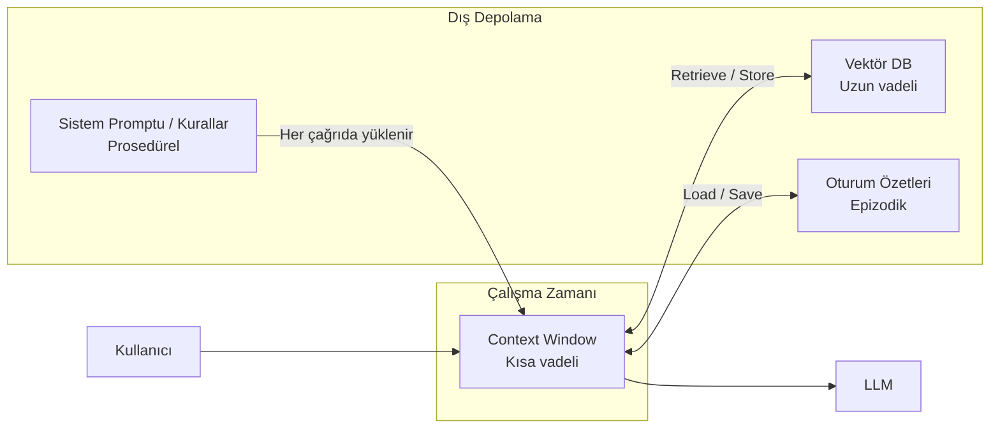

## TL;DR

Agent hafızası dört katmana ayrılır: anlık bağlam (context window), uzun vadeli vektör depoları (vector store), epizodik özetler (oturum geçmişi) ve prosedürel beceriler (öğrenilen davranışlar). Hangi bilginin nerede saklanacağı, agent'ın hem maliyetini hem de etkinliğini doğrudan belirler.

## Detaylı açıklama

İnsan hafızası nasıl kısa ve uzun vadeli olarak ayrılırsa, agent hafızası da benzer katmanlara ayrılır. Her katmanın farklı hızı, kapasitesi ve maliyeti vardır.

### Hafıza türleri

**1. Kısa Vadeli Hafıza (Short-term / In-context Memory)**

Mevcut konuşma ve bağlam penceresinde (context window) tutulan bilgidir. Agent'ın "çalışma masası"dır. Claude'da 1 milyon, GPT-4o'da 128 bin token kapasitesi vardır. Oturum kapanınca kaybolur.

**2. Uzun Vadeli Hafıza (Long-term / External Memory)**

Vektör veritabanlarında (Pinecone, Chroma, pgvector) saklanan semantik bilgi. Agent ihtiyaç duyduğunda anlamsal arama (semantic search) ile getirir. RAG mimarisinin temelidir.

**3. Epizodik Hafıza (Episodic Memory)**

Geçmiş oturumların özetleri. Her oturum kapanırken "Bu sohbette ne oldu?" özeti oluşturulur ve saklanır. Bir sonraki oturumda agent bu özeti context'e ekler; böylece önceki konuşmaları "hatırlar".

**4. Prosedürel Hafıza (Procedural Memory)**

Agent'ın öğrendiği beceriler ve davranış şablonları. Fine-tuning, sistem promptuna yazılan kurallar veya araç kullanım geçmişi bu kategoriye girer. En kalıcı hafıza türüdür.



<Callout type="info">
Claude Code'un `memory.md` dosyası prosedürel hafızanın somut örneğidir: agent öğrendiklerini bu dosyaya yazar ve her oturumda okur. Bu, "pointer index" olarak da bilinir.
</Callout>

### Hafıza yönetimi stratejileri

**Özetleme (Summarization):** Context dolmadan önce eski konuşmayı özetle ve özeti sakla. Token maliyetini kontrol altında tutar.

**Seçici getirme (Selective Retrieval):** Her şeyi context'e yüklemek yerine yalnızca ilgili bilgiyi semantik arama ile getir.

**Kompaksiyon (Compaction):** Anthropic terminolojisinde; uzun oturumda eski mesajları sıkıştırarak bağlamı temizleme işlemi.

**Checkpoint:** LangGraph gibi framework'lerde her adımda durum (state) kaydedilir; agent kaldığı yerden devam edebilir.

## Minimal örnek

```python
from anthropic import Anthropic
import json
from pathlib import Path

client = Anthropic()
MEMORY_FILE = Path("agent_memory.json")

def load_memory() -> list:
    if MEMORY_FILE.exists():
        return json.loads(MEMORY_FILE.read_text())
    return []

def save_memory(messages: list):
    # Son 10 mesajı sakla (basit epizodik hafıza)
    MEMORY_FILE.write_text(json.dumps(messages[-10:]))

def chat(user_input: str):
    history = load_memory()
    history.append({"role": "user", "content": user_input})
    response = client.messages.create(
        model="claude-sonnet-4-5",
        max_tokens=512,
        system="Sen yardımcı bir asistansın. Önceki konuşmaları hatırlıyorsun.",
        messages=history
    )
    reply = response.content[0].text
    history.append({"role": "assistant", "content": reply})
    save_memory(history)
    return reply

print(chat("Benim adım Ahmet."))
print(chat("Adımı hatırlıyor musun?"))  # "Ahmet" diyecek
```

## Gerçek dünya örneği

Bir kişisel asistan agent'ı şu hafıza katmanlarını kullanır:

- **Kısa vadeli:** Mevcut oturumdaki kullanıcı tercihleri ve görevler
- **Uzun vadeli (vektör DB):** Kullanıcının geçmişte eklediği dokümanlar, notlar, e-postalar
- **Epizodik:** "Geçen hafta Ankara toplantısını planladık, bu haftaya katılımcı listesi lazım" özeti
- **Prosedürel:** "Bu kullanıcı her sabah 08:00'de özet ister, kısa ve madde madde formatı tercih eder" kuralı

Bu katmanların birlikte çalışması agent'ı gerçek anlamda "sizi tanıyan" bir asistana dönüştürür.

## Avantajlar / Sınırlamalar

| Avantaj | Sınırlama |
|---|---|
| Oturumlar arası süreklilik sağlar | Vektör DB kurulumu ve bakım maliyeti |
| Uzun sohbet geçmişi yönetilebilir hale gelir | Yanlış veya güncelliğini yitirmiş bilgi birikebilir |
| Kişiselleştirilmiş, bağlamsal yanıtlar mümkün | "Hafıza zehirlenmesi" riski: hatalı bilgi kalıcı hale gelebilir |
| Context penceresi aşılabilir | Hangi bilginin ne zaman alınacağı karmaşık bir tasarım sorunudur |

## Ne zaman kullanılır / kullanılmaz

**Kullanılır:**
- Çok oturumlu uygulamalarda (kişisel asistan, müşteri desteği)
- Kullanıcıya özel kişiselleştirme gerektiğinde
- Büyük doküman kümeleriyle çalışılıyorsa (RAG gerekliyse)
- Uzun görevlerin checkpoint ile devam etmesi gerekiyorsa

**Kullanılmaz:**
- Tek seferlik, bağlamsız sorgularda (hafıza overhead'ı gereksiz)
- Gizlilik kritik ve bilgi saklanamıyorsa
- Her yanıtın tamamen taze (stale bilgisiz) olması gerekiyorsa

<Callout type="uyari">
Hafıza sistemleri zamanla "kirlenebilir." Yanlış öğrenilmiş bilgi veya eski tercihler agent davranışını bozabilir. Periyodik hafıza temizleme ve doğrulama mekanizmaları kurun.
</Callout>

## İlişkili kavramlar

- [RAG ve Agentic RAG](/kavramlar/rag-ve-agentic-rag) — uzun vadeli hafızanın en yaygın uygulaması
- [Model Bağlam Yönetimi (Model Context Management)](/kavramlar/model-context-management) — context window'u verimli kullanma
- [Yansıma (Reflection)](/kavramlar/reflection) — agent'ın geçmiş deneyimlerden öğrenmesi
- [Planlama (Planning)](/kavramlar/planning) — hafızayı planlama döngüsüne entegre etme

## Daha derine

- **MemGPT: Towards LLMs as Operating Systems** (Packer et al., 2023) — hiyerarşik bellek yönetimi mimarisi
- **Generative Agents: Interactive Simulacra of Human Behavior** (Park et al., 2023) — epizodik ve uzun vadeli hafızanın birlikte kullanımı
- **A Survey on the Memory Mechanism of Large Language Model based Agents** (Zhang et al., 2024)
- LangGraph persistence ve checkpoint rehberi (python.langchain.com)
- Anthropic agent hafıza tasarımı (docs.anthropic.com/agents)
- Chroma, Pinecone, pgvector resmi dokümantasyonları
