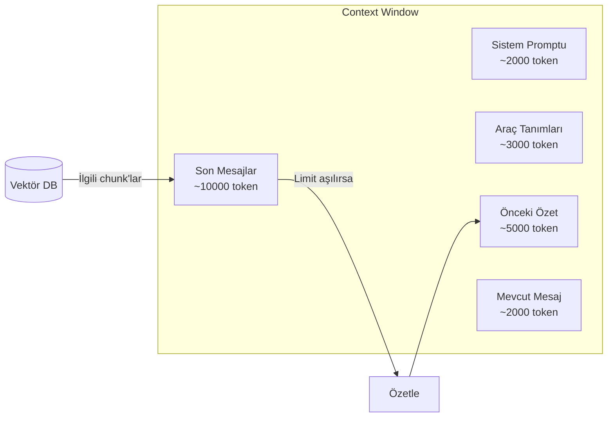

## TL;DR

Her LLM'in token cinsinden sınırlı bir bağlam penceresi (context window) vardır; bu pencere dolduğunda model eski bilgilere erişemez. Model bağlam yönetimi, bu pencereyi verimli kullanmak için özetleme, sıkıştırma (compaction), seçici getirme ve checkpoint gibi teknikleri sistematik biçimde uygular.

## Detaylı açıklama

Claude'un 1 milyon token bağlam penceresi etkileyici görünse de gerçek dünya agent'larında bu pencere şaşırtıcı hızda dolar: her araç çağrısı, her araç sonucu, her düşünce adımı ve geçmiş konuşma bu pencereye işlenir.

### Neden önemli?

- **Maliyet:** Tüm token'lar faturalandırılır. Uzun bağlam = yüksek fatura.
- **Kalite:** Bağlam penceresi çok dolarsa model "kayıp ortası" sorunuyla karşılaşır — ortadaki bilgileri unutur.
- **Hız:** Uzun bağlam işleme süresi artar (latency).
- **Güvenilirlik:** Kritik bilgi sınırın dışına itilirse agent hatalı karar alır.

### Temel bağlam yönetimi teknikleri

**1. Özetleme (Summarization)**

Konuşma geçmişi belirli bir noktaya ulaştığında eski mesajlar özetlenir. Özet context'te tutulur, ham mesajlar düşürülür.

```
[mesaj 1..50] → özetle → [özet] + [mesaj 51..100]
```

**2. Kompaksiyon (Compaction)**

Anthropic terminolojisi. Uzun bir agent oturumunda gereksiz düşünce adımları, tekrar eden araç sonuçları ve ara yanıtlar sıkıştırılır. Claude Code bu tekniği otomatik uygular.

**3. Kayan Pencere (Sliding Window)**

Yalnızca son N mesaj context'te tutulur. Basit ama önemli bilgi kaybı riski yüksektir.

**4. Seçici Yükleme (Selective Loading)**

Tüm geçmiş context'e yüklenmez; yalnızca mevcut görevle ilgili kısımlar RAG ile getirilir. "Pointer index" yaklaşımı: hafızaya içeriği değil, içeriğin bulunduğu referansı kaydet.

**5. Checkpoint**

LangGraph tarzı: her önemli adımda durum diske kaydedilir. Bağlam yeniden başlatılması gerektiğinde checkpoint'ten yüklenir; tüm geçmiş yeniden işlenmez.

**6. Özel Token Bütçesi (Token Budget)**

Her konuşma bileşenine token bütçesi atanır: sistem promptu (X token), araç tanımları (Y token), geçmiş (Z token), yeni mesaj (W token). Bütçe aşılınca ilgili bileşen otomatik kısaltılır.



### Maliyet-Bağlam dengesi

<Callout type="uyari">
**Maliyet uyarısı:** Çoklu agent sistemlerinde her agent kendi context penceresini taşır ve her agent-arası mesaj yeni bir model çağrısı yapar. 5 agent × 50.000 token bağlam × 100 çağrı/gün = 25 milyon token/gün. Haiku yerine Opus kullanılırsa bu, aylık yüzlerce Euro farkı yaratır.

**Zorunlu disiplin:** Araç tanımları yalnızca o görev için gerekli olanlarla sınırlı tutulmalı; eski konuşmalar agresif biçimde özetlenmeli; subagent'lara bağımsız küçük bağlamlar verilmeli.
</Callout>

### Claude Code'un "memory.md" yaklaşımı

Claude Code, agent'ın uzun vadeli bilgisi için `memory.md` dosyasını kullanır. Bu "pointer index" yaklaşımıdır:
- Tüm tarihsel bilgi context'e yüklenmez
- Yalnızca "Bu projeyle ilgili öğrendiklerim" özeti bir MD dosyasında tutulur
- Her oturum başında bu dosya okunur, context'e eklenir
- Dosya sınırı (genellikle 2-5K token) korunur

## Minimal örnek

```python
from anthropic import Anthropic

client = Anthropic()
MAX_HISTORY_TOKENS = 4000  # Yaklaşık eşik

def estimate_tokens(messages: list) -> int:
    return sum(len(str(m.get("content", ""))) // 4 for m in messages)

def compress_history(messages: list) -> list:
    if estimate_tokens(messages) < MAX_HISTORY_TOKENS:
        return messages

    # Eski mesajları özetle
    old_messages = messages[:-4]  # Son 4 mesajı koru
    summary_prompt = "Şu konuşmayı 200 kelimede özetle:\n"
    summary_prompt += "\n".join(f"{m['role']}: {m['content']}" for m in old_messages)

    summary_resp = client.messages.create(
        model="claude-haiku-3-5",  # Özet için ucuz model
        max_tokens=300,
        messages=[{"role": "user", "content": summary_prompt}]
    )
    summary = summary_resp.content[0].text
    return [
        {"role": "user", "content": f"[Önceki konuşma özeti]: {summary}"},
        {"role": "assistant", "content": "Anladım, devam ediyoruz."},
        *messages[-4:]
    ]

history = []
for user_input in ["Merhaba", "Python async nedir?", "Örnek ver", "Teşekkürler"]:
    history.append({"role": "user", "content": user_input})
    history = compress_history(history)
    response = client.messages.create(
        model="claude-sonnet-4-5", max_tokens=256, messages=history
    )
    reply = response.content[0].text
    history.append({"role": "assistant", "content": reply})
    print(f"Token tahmini: {estimate_tokens(history)}")
```

## Gerçek dünya örneği

Uzun süreli bir kodlama oturumunda (4 saat, yüzlerce dosya değişikliği):

1. **İlk 30 dakika:** Tüm konuşma history'de tutulur
2. **30-60 dakika:** Eski adımlar otomatik özetlenir, kritik kararlar korunur
3. **Saat 2:** Checkpoint alınır — agent durumu diske kaydedilir
4. **Saat 3:** Yeni bir bağlam başlatılır, checkpoint ve memory.md yüklenir
5. **Saat 4:** Kullanıcı "nereye kadar gelmiştik?" diye sorar — agent checkpoint'ten tam bağlamı geri yükler

Bu olmadan 4 saatlik oturum bağlam limiti nedeniyle baştan başlamak zorunda kalırdı.

## Avantajlar / Sınırlamalar

| Avantaj | Sınırlama |
|---|---|
| Uzun oturumlar token limiti olmadan çalışır | Agresif özetleme kritik detay kaybettirebilir |
| Maliyet dramatik biçimde düşer | Checkpoint/sıkıştırma ek mühendislik gerektirir |
| Gecikme (latency) azalır — daha az token işlenir | Hangi bilginin önemli olduğuna karar vermek zordur |
| Büyük projelerde agent tutarlılığı korunur | Sıkıştırma kalitesi kullanılan modele bağlı |

## Ne zaman kullanılır / kullanılmaz

**Kullanılır:**
- Uzun oturumlar veya çok adımlı görevlerde
- Çoklu agent sistemlerinde maliyet kontrolü için
- Çok sayıda araç tanımı veya büyük doküman setleriyle çalışırken
- Üretim sistemlerinde token bütçesi kritikse

**Kullanılmaz:**
- Kısa, tek turlu sorgularda (overhead gereksiz)
- Context penceresi hiç dolmuyorsa
- Basit chatbot uygulamalarında

<Callout type="ipucu">
LangSmith veya benzeri bir gözlemlenebilirlik aracı kullanıyorsanız her oturumun token kullanımını izleyin. Anormal tüketim genellikle bağlam sıkışması (context bloat) veya gereksiz araç tanımlarından kaynaklanır.
</Callout>

## İlişkili kavramlar

- [Hafıza (Memory)](/kavramlar/memory) — bağlam yönetimi ve hafıza el ele çalışır
- [RAG ve Agentic RAG](/kavramlar/rag-ve-agentic-rag) — bağlama seçici bilgi yüklemenin ana yöntemi
- [Planlama (Planning)](/kavramlar/planning) — planlama döngüsü bağlamı hızla tüketir
- [Agent Orkestrasyonu (Agent Orchestration)](/kavramlar/agent-orchestration) — orkestrasyon mimarisi bağlam paylaşımını etkiler

## Daha derine

- **Lost in the Middle: How Language Models Use Long Contexts** (Liu et al., 2023) — bağlam penceresinin ortasındaki bilgi kaybı
- **MemGPT: Towards LLMs as Operating Systems** (Packer et al., 2023) — hiyerarşik bellek yönetimi
- Anthropic context management rehberi (docs.anthropic.com)
- LangGraph persistence ve checkpoint dokümantasyonu
- Claude Code `memory.md` rehberi (docs.anthropic.com/claude-code)
- [Multi-model maliyet stratejileri](/workflow/multi-model-stratejileri)
