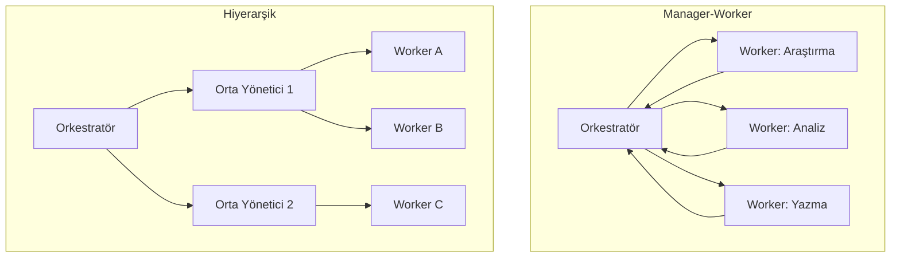

## TL;DR

Çoklu agent sistemleri (Multi-Agent Systems — MAS), farklı rol ve yeteneklere sahip birden fazla agent'ın birlikte çalışarak tek bir agent'ın çözemeyeceği karmaşık görevleri tamamladığı mimaridir. Manager-worker, grup sohbeti ve hiyerarşik düzenlemeler temel örüntülerdir. Ancak her ek agent yeni bir model çağrısı anlamına gelir; maliyet disiplini zorunludur.

## Detaylı açıklama

Tek bir agent'ın ötesine geçmek ne zaman gerekir? Görev paralel işlenebilecek alt parçalara ayrılıyorsa, farklı uzmanlık gerektiren bölümler varsa veya tek bir context penceresi tüm bilgiyi taşıyamıyorsa çoklu agent sistemleri devreye girer.

### Temel MAS örüntüleri

**Manager-Worker (Yönetici-İşçi)**

En yaygın örüntü. Bir orkestratör agent görevi planlar ve alt görevleri worker (işçi) agent'lara dağıtır. Worker'lar sonuçları orkestratöre gönderir; orkestratör bunları birleştirir.

```
Orkestratör: "Bu araştırma raporunu hazırla"
  ├── Worker 1 (Araştırmacı): Web araması + kaynak toplama
  ├── Worker 2 (Analist): Toplanan veriyi özetleme
  └── Worker 3 (Yazar): Özetten rapor oluşturma
```

**Group Chat (Grup Sohbeti)**

Tüm agent'lar bir "oda"da konuşur; bir moderatör (veya dönüşümlü konuşma) konuşma sırasını yönetir. CrewAI ve AutoGen bu modeli kullanır.

**Hiyerarşik (Hierarchical)**

Orkestratör → Orta kademe yöneticiler → Worker'lar. Büyük, karmaşık projelerde kullanılır. Claude Code Subagents bu örüntüyü uygular.

**Peer-to-Peer**

Agent'lar doğrudan birbirleriyle mesajlaşır, merkezi orkestrasyon yoktur. A2A protokolü bu tür iletişimi standartlaştırmak üzere geliştirilmektedir.



### Maliyet disiplini

<Callout type="uyari">
**Kritik uyarı:** Her agent-arası mesaj bir model çağrısıdır. 5 agent'lı bir sistemde, her agent 3 tur çalışırsa 15 model çağrısı olur. Tüm agent'ları Opus veya Gemini 3 Pro ile çalıştırmak haftalık 3 haneli Euro faturalar yaratabilir.

**Zorunlu disiplin:** Subagent başına model atayın:
- Orkestratör / planlama: Sonnet (orta maliyet, iyi akıl yürütme)
- Araştırma / veri toplama: Haiku (düşük maliyet, yeterli)
- Eleştirmen / kalite kontrol: Sonnet
- Kod üretim: Sonnet veya Opus (kalite kritik olduğunda)
</Callout>

### Agent iletişim protokolleri

Agent'lar birbirleriyle nasıl haberleşir?

- **Paylaşılan durum (Shared State):** LangGraph tarzı — tüm agent'lar ortak bir durum nesnesine yazar/okur
- **Mesaj kuyruğu (Message Queue):** Agent'lar asenkron mesaj gönderir (Redis, RabbitMQ)
- **Doğrudan API çağrısı:** Bir agent, diğer agent'ı HTTP endpoint olarak çağırır
- **A2A Protokol:** Standart agent-to-agent iletişim protokolü (bkz. [A2A Protokol](/kavramlar/a2a-protokol))

## Minimal örnek

```python
from anthropic import Anthropic

client = Anthropic()

def run_agent(role: str, system: str, task: str, model: str = "claude-haiku-3-5") -> str:
    response = client.messages.create(
        model=model,
        max_tokens=512,
        system=system,
        messages=[{"role": "user", "content": task}]
    )
    return response.content[0].text

# Worker 1: Araştırmacı (ucuz model)
research = run_agent(
    role="researcher",
    system="Sen bir araştırmacısın. Verilen konuda temel bilgileri özetle.",
    task="Python async programlama hakkında temel bilgileri özetle.",
    model="claude-haiku-3-5"
)

# Worker 2: Yazar (orta model)
article = run_agent(
    role="writer",
    system="Sen bir teknik yazarsın. Verilen araştırmadan blog yazısı oluştur.",
    task=f"Bu araştırmadan blog yazısı oluştur:\n{research}",
    model="claude-sonnet-4-5"
)

print("Makale:\n", article)
```

## Gerçek dünya örneği

Bir içerik ajansının MAS hattı:

1. **Konu Agent'ı (Haiku):** RSS ve trend verilerinden yazılacak konu listesi çıkarır
2. **Araştırma Agent'ı (Haiku):** Her konu için web araması, kaynak toplama
3. **Yazar Agent'ı (Sonnet):** Araştırmadan taslak üretir
4. **Editör Agent'ı (Sonnet):** Taslağı SEO, gramer ve ton açısından değerlendirir
5. **Onay Noktası (İnsan):** Editörden geçen içerik yayınlanmadan önce insan gözetiminden geçer

Tek bir agent bu hattı çalıştırabilir mi? Teorik olarak evet; ancak paralel çalışma imkansızlaşır, uzmanlık sınırlanır ve hata ayıklama güçleşir.

## Avantajlar / Sınırlamalar

| Avantaj | Sınırlama |
|---|---|
| Paralel çalışmayla önemli hız kazancı | Her agent-arası mesaj ek maliyet |
| Uzmanlaşmış agent'larla daha yüksek kalite | Orkestrasyon karmaşıklığı hata riskini artırır |
| Büyük görevleri küçük parçalara böler | Hata ayıklama ve gözlemlenebilirlik zordur |
| Tek context penceresini aşar | Agent'lar arası tutarsızlık riski |
| Model çeşitlendirmesiyle maliyet optimizasyonu | Gecikme (latency) birikebilir |

## Ne zaman kullanılır / kullanılmaz

**Kullanılır:**
- Görev gerçekten paralel parçalara ayrılabiliyorsa
- Farklı uzmanlık rolleri gerekiyorsa
- Tek context penceresi yetmiyorsa
- İş akışı bağımsız doğrulanabilir adımlar içeriyorsa

**Kullanılmaz:**
- Tek agent yeterliyse (gereksiz karmaşıklık eklemeyin)
- Maliyet bütçesi çok sıkıysa
- Agent'lar arası koordinasyon maliyeti kazanımdan fazlaysa
- Sıkı gecikme (latency) gereksinimleri varsa

<Callout type="ipucu">
Başlangıç için tek agent ile deneyin. Gerçekten paralel yapı gerektiren veya uzmanlık sınırına çarpan durumlarda multi-agent mimarisine geçin. "Önce basit, gerektiğinde karmaşıklaştır" ilkesi maliyet ve geliştirme süresini önemli ölçüde düşürür.
</Callout>

## İlişkili kavramlar

- [Agent Orkestrasyonu (Agent Orchestration)](/kavramlar/agent-orchestration) — MAS'ın koordinasyon ve yönetim boyutu
- [Planlama (Planning)](/kavramlar/planning) — orkestratörün iş bölümü stratejisi
- [İnsanlı Döngü (Human-in-the-Loop)](/kavramlar/human-in-the-loop) — MAS'ta insan onay noktaları
- [A2A Protokol](/kavramlar/a2a-protokol) — agent'lar arası standart iletişim
- [MCP Protokol](/kavramlar/mcp-protokol) — agent'ların araçlara standart erişimi

## Daha derine

- **Communicative Agents for Software Development (ChatDev)** (Qian et al., 2023)
- **MetaGPT: Meta Programming for Multi-Agent Collaborative Framework** (Hong et al., 2023)
- **AutoGen: Enabling Next-Gen LLM Applications via Multi-Agent Conversation** (Wu et al., 2023)
- Anthropic Multi-agent framework rehberi (docs.anthropic.com)
- LangGraph multi-agent mimarileri (python.langchain.com)
- CrewAI çoklu agent dokümantasyonu (docs.crewai.com)
- [Maliyet stratejileri için bkz. /workflow/multi-model-stratejileri](/workflow/multi-model-stratejileri)
