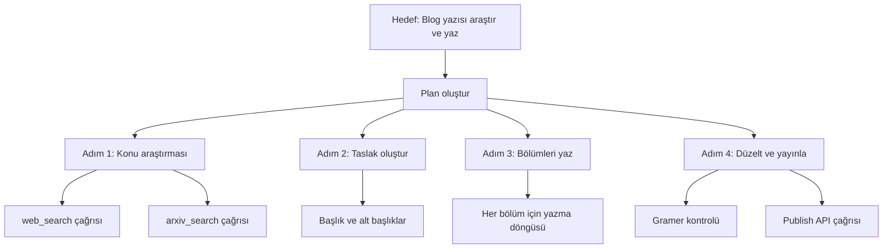

## TL;DR

Planlama (planning), bir agent'ın karmaşık bir hedefi birden fazla adıma bölerek sıralı ya da paralel biçimde çözmesidir. ReAct, Plan-and-Execute ve Tree of Thoughts bu alanın temel desenleridir. İyi planlama olmadan agent tek adımlı sorulara mahkum kalır; planlama onu gerçek anlamda otonom yapar.

## Detaylı açıklama

Basit bir LLM çağrısı şöyle çalışır: soru → cevap. Planlama bu zinciri genişletir: hedef → alt görevler → her alt görev için eylem → sonuçları birleştir → hedefe ulaş.

### Temel planlama desenleri

**ReAct (Reason + Act)**

En yaygın desen. Model her adımda önce düşünür (reason), sonra eylem yapar (act), ardından gözlem (observation) alır. Bu döngü sonuca ulaşana dek tekrar eder.

```
Düşünce: "Kullanıcı İstanbul'un nüfusunu ve yüzölçümünü soruyor. Önce web araması yapayım."
Eylem: web_search("İstanbul nüfus 2026")
Gözlem: "İstanbul nüfusu ~15 milyon (2026 tahmini)"
Düşünce: "Şimdi yüzölçümünü arayayım."
Eylem: web_search("İstanbul yüzölçümü km2")
Gözlem: "İstanbul yüzölçümü 5.461 km²"
Düşünce: "Tüm bilgi elimde, yanıt verebilirim."
Yanıt: "İstanbul'un nüfusu yaklaşık 15 milyon, yüzölçümü 5.461 km²'dir."
```

**Plan-and-Execute**

İki aşamalı yaklaşım: önce tüm planı oluştur, sonra adım adım çalıştır. Daha öngörülebilir ve takip edilebilir; ancak planın ortasında adapte olmak güçtür.

**Tree of Thoughts (Düşünce Ağacı)**

Model birden fazla olası çözüm yolu oluşturur, her dalı değerlendirir ve en umut verici olanı seçer. Karmaşık problem çözme ve yaratıcı görevler için güçlüdür.

**Hierarchical Planning (Hiyerarşik Planlama)**

Üst seviye plan → alt planlar → atomik eylemler. Büyük projelerde veya çok-agent sistemlerinde kullanılır.



<Callout type="info">
ReAct deseni, görece az token harcamasıyla iyi sonuç verir ve çoğu framework'ün varsayılan planlama yaklaşımıdır. Plan-and-Execute daha fazla kontrol gerektiğinde tercih edilir.
</Callout>

## Minimal örnek

```python
from anthropic import Anthropic

client = Anthropic()
conversation = []

SYSTEM = """Sen bir planlama agent'ısın. Karmaşık görevleri adımlara böl.
Her adımda:
DÜŞÜNCE: [ne yapacağını açıkla]
EYLEM: [tool_name(params)] veya YANIT: [son cevap]
"""

def run_planning_agent(goal: str):
    conversation.append({"role": "user", "content": goal})
    for _ in range(5):  # Maksimum 5 tur
        response = client.messages.create(
            model="claude-sonnet-4-5",
            max_tokens=1024,
            system=SYSTEM,
            messages=conversation
        )
        reply = response.content[0].text
        conversation.append({"role": "assistant", "content": reply})
        if "YANIT:" in reply:
            return reply.split("YANIT:")[-1].strip()
        # Gerçek uygulamada araç çalıştırma buraya gelir
    return "Maksimum tur sayısına ulaşıldı."

result = run_planning_agent("Python ile web scraping nasıl yapılır, adımları anlat.")
print(result)
```

## Gerçek dünya örneği

Bir araştırma asistanı "2026'daki AI güvenlik raporlarını toplayıp özet çıkar" görevini alır. Plan şöyle oluşur:

1. "AI safety report 2026" için birden fazla arama motoru sorgusu çalıştır
2. Bulunan PDF/HTML linkleri filtrele (yalnızca son 6 ay)
3. Her kaynağı oku, ana bulguları çıkar
4. Tüm bulguları birleştirip yapılandırılmış özet oluştur
5. Özeti Markdown formatında çıktıla

Tek bir LLM çağrısıyla bu görev çözülemez; planlama mekanizması her adımı sıralı yönetir.

## Avantajlar / Sınırlamalar

| Avantaj | Sınırlama |
|---|---|
| Karmaşık, çok adımlı görevleri çözebilme | Her tur ek token ve gecikme maliyeti |
| Agent'ı gözlemlenebilir ve hata ayıklanabilir kılar | Plan hatalıysa tüm zincir yanlış gider |
| Adapte planlama (ReAct) değişen koşullara uyum sağlar | Döngü veya sonsuz tekrar riski |
| Uzun vadeli hedefleri yönetebilme | Planı doğrulamak için insan gözetimi gerekebilir |

## Ne zaman kullanılır / kullanılmaz

**Kullanılır:**
- Görev birden fazla adım gerektiriyorsa
- Önceki adımın sonucu sonraki adımı etkiliyorsa
- Belirsiz veya açık uçlu hedefler söz konusuysa
- Araştırma, yazma, analiz gibi bilişsel ağır görevlerde

**Kullanılmaz:**
- Tek adımlı basit sorular için (gereksiz overhead)
- Determinizm kritik ve her adımın öngörülmesi gerekiyorsa
- Gerçek zamanlı düşük gecikmeli uygulamalar için
- Araç erişimi yoksa (planlama araçsız anlamsızlaşır)

<Callout type="uyari">
"Sonsuz döngü" riski: agent planladığı adımı tamamlayamayıp aynı araçları tekrar tekrar çağırabilir. Mutlaka maksimum tur (max_turns) ve timeout limiti koyun.
</Callout>

## İlişkili kavramlar

- [Araç Kullanımı (Tool Use)](/kavramlar/tool-use) — planlamanın eylem ayağı
- [Yansıma (Reflection)](/kavramlar/reflection) — planın çalışma sırasında kendini değerlendirmesi
- [Çoklu Agent Sistemleri (Multi-Agent Systems)](/kavramlar/multi-agent-systems) — birden fazla agent'ı koordine eden üst düzey planlama
- [Agent Orkestrasyonu (Agent Orchestration)](/kavramlar/agent-orchestration) — planın farklı agent'lara dağıtılması

## Daha derine

- **ReAct: Synergizing Reasoning and Acting in Language Models** (Yao et al., 2022)
- **Tree of Thoughts: Deliberate Problem Solving with Large Language Models** (Yao et al., 2023)
- **Plan-and-Solve Prompting** (Wang et al., 2023)
- **HuggingGPT / JARVIS** (Shen et al., 2023) — planlama ile araç seçimini birleştiren mimari
- LangGraph planlama desenleri (blog.langchain.dev)
- Anthropic agent tasarımı rehberi (docs.anthropic.com/agents)
