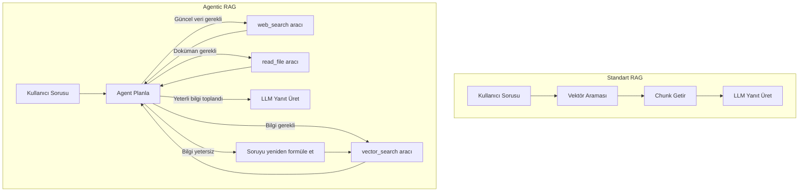

## TL;DR

RAG (Retrieval-Augmented Generation — Geri Çağırma Destekli Üretim), LLM'in bilmediği veya güncel olmayan konularda harici doküman deposundan ilgili parçaları (chunk) alarak yanıt üretmesini sağlar. Agentic RAG bu süreci bir adım öteye taşır: ne zaman, nereden ve nasıl bilgi alınacağını agent dinamik olarak kararlaştırır.

## Detaylı açıklama

### Standart RAG

Klasik RAG üç adımdan oluşur:

1. **İndeksleme (Indexing):** Dokümanlar küçük parçalara (chunk) bölünür ve vektör temsilleri (embedding) hesaplanarak vektör veritabanına kaydedilir.
2. **Geri çağırma (Retrieval):** Kullanıcı sorusu vektöre dönüştürülür ve en yakın doküman parçaları bulunur (semantik arama).
3. **Üretim (Generation):** Bulunan parçalar LLM'in context'ine eklenerek yanıt üretilir.

**Standart RAG'ın sınırları:**
- Her sorguda aynı mekanizma çalışır (esneksiz)
- Birden fazla kaynaktan bilgi birleştirme zayıftır
- Retrieval stratejisi sabit, adapte olamaz

### Agentic RAG

Agentic RAG'da retrieval bir araç (tool) haline gelir; agent bunu diğer araçlarla birlikte kullanır ve gerekip gerekmediğine kendisi karar verir.

**Farklar:**

| Özellik | Standart RAG | Agentic RAG |
|---|---|---|
| Retrieval kararı | Her sorguda otomatik | Agent gerektiğinde çağırır |
| Kaynak sayısı | Tek vektör deposu | Çoklu kaynak (web, DB, dosya) |
| Sorgu stratejisi | Sabit | Yeniden formüle, çok turlu |
| Doğrulama | Yok | Agent sonuçları doğrulayabilir |
| Karmaşıklık | Düşük | Yüksek |



### Çok turlu Agentic RAG

Agent bir turda yeterli bilgi bulamazsa:
1. Sorguyu farklı şekillerde yeniden formüle eder
2. Farklı kaynaklara yönelir
3. Bulduğu bilgilerin tutarlı olup olmadığını kontrol eder
4. Eksik parçaları tespit edip hedefli aramalar yapar

Bu yaklaşım, karmaşık araştırma sorularında standart RAG'dan belirgin biçimde üstündür.

<Callout type="info">
Agentic RAG, agent'ın bir aracıdır — her zaman çalıştırılmak zorunda değildir. Kullanıcı basit bir soru sorduğunda agent retrieval atlar; karmaşık bir araştırma görevi geldiğinde birden fazla kaynak sorgular.
</Callout>

## Minimal örnek

```python
from anthropic import Anthropic
import json

client = Anthropic()

# Basit belge deposu (gerçekte vektör DB)
DOCS = {
    "python_basics": "Python dinamik tipli, yorumlanan bir dildir. 1991'de Guido van Rossum tarafından geliştirildi.",
    "python_async": "Python'da async/await ile asenkron programlama 3.5 versiyonunda eklendi.",
    "python_types": "Python 3.5+ ile type hints kullanılabilir. mypy ile statik tip kontrolü yapılır."
}

def search_docs(query: str) -> str:
    # Basit anahtar kelime araması (gerçekte semantik arama)
    results = [v for k, v in DOCS.items() if any(w in k for w in query.lower().split())]
    return "\n".join(results) if results else "Sonuç bulunamadı."

tools = [{
    "name": "search_docs",
    "description": "Bilgi tabanında arama yapar",
    "input_schema": {
        "type": "object",
        "properties": {"query": {"type": "string"}},
        "required": ["query"]
    }
}]

def agentic_rag(question: str) -> str:
    messages = [{"role": "user", "content": question}]
    while True:
        response = client.messages.create(
            model="claude-sonnet-4-5", max_tokens=512,
            tools=tools, messages=messages
        )
        if response.stop_reason == "tool_use":
            tool_call = next(b for b in response.content if b.type == "tool_use")
            result = search_docs(tool_call.input["query"])
            messages += [
                {"role": "assistant", "content": response.content},
                {"role": "user", "content": [{"type": "tool_result",
                    "tool_use_id": tool_call.id, "content": result}]}
            ]
        else:
            return response.content[0].text

print(agentic_rag("Python'da asenkron programlama nasıl çalışır?"))
```

## Gerçek dünya örneği

Bir hukuk firmasının sözleşme analiz asistanı:

- **Standart RAG:** "Bu sözleşmede fesih maddesi var mı?" — tek kaynak, basit arama
- **Agentic RAG:** "Bu sözleşme rakip firmaların standart sözleşmeleriyle karşılaştırıldığında riskleri neler?" — çoklu kaynak, içtihat araması, web araması, çapraz doğrulama, özetleme

İkinci görev için agentic RAG kaçınılmazdır; standart RAG yeterli değildir.

## Avantajlar / Sınırlamalar

| Avantaj | Sınırlama |
|---|---|
| LLM'in bilgi sınırını gerçek zamanlı aşar | İndeksleme ve vektör DB altyapı maliyeti |
| Agentic yaklaşım çok kaynaklı bilgi sentezler | Chunk boyutu yanlış seçilirse kalite düşer |
| Kaynak şeffaflığı — yanıtlar belgelere dayalı | Embedding modeli kalitesi retrieval'ı doğrudan etkiler |
| Halüsinasyon riski azalır | Agentic RAG standart RAG'dan daha pahalı ve yavaş |
| Güncelleme kolay — yeni doküman ekle, yeniden indeksle | Retrieval kalitesi doğrulama zordur |

## Ne zaman kullanılır / kullanılmaz

**RAG kullanılır:**
- Model büyük özel doküman setleri hakkında soruları yanıtlayacaksa
- Güncel, değişen bilgilere erişim gerekiyorsa
- Yanıtların kaynaklara dayanması gerekiyorsa (hukuk, tıp, uyumluluk)

**Agentic RAG kullanılır:**
- Sorunun yanıtı birden fazla kaynaktan birleştirme gerektiriyorsa
- Retrieval stratejisinin soruya göre değişmesi gerekiyorsa
- Çok turlu araştırma ve doğrulama gerekiyorsa

**Kullanılmaz:**
- Model zaten geniş ve güncel bilgiye sahipse
- Basit, değişmeyen bilgi için (FAQ tarzı statik içerik)
- Altyapı maliyeti bütçeyi aşıyorsa

<Callout type="uyari">
RAG sihirli değnek değildir. Kötü kalitede dokümanlar, hatalı chunk boyutları veya zayıf embedding modeli, RAG sistemini kullanışsız kılar. "Çöp girer, çöp çıkar" ilkesi retrieval için de geçerlidir.
</Callout>

## İlişkili kavramlar

- [Hafıza (Memory)](/kavramlar/memory) — uzun vadeli hafızanın en yaygın uygulaması RAG'dır
- [Araç Kullanımı (Tool Use)](/kavramlar/tool-use) — Agentic RAG'da retrieval bir araçtır
- [Planlama (Planning)](/kavramlar/planning) — agent hangi kaynakları ne sırayla sorgulayacağına karar verir
- [Model Bağlam Yönetimi (Model Context Management)](/kavramlar/model-context-management) — chunk'lar context penceresini tüketir

## Daha derine

- **Retrieval-Augmented Generation for Knowledge-Intensive NLP Tasks** (Lewis et al., 2020) — RAG'ın temel makalesi
- **REALM: Retrieval-Augmented Language Model Pre-Training** (Guu et al., 2020)
- **Self-RAG: Learning to Retrieve, Generate, and Critique through Self-Reflection** (Asai et al., 2023)
- **CRAG: Corrective Retrieval Augmented Generation** (Yan et al., 2024)
- LangChain RAG kılavuzu (python.langchain.com)
- LlamaIndex dokümantasyonu (docs.llamaindex.ai)
- [Modül 03: RAG Kurulumu](/modul/03-rag-kurulumu)
