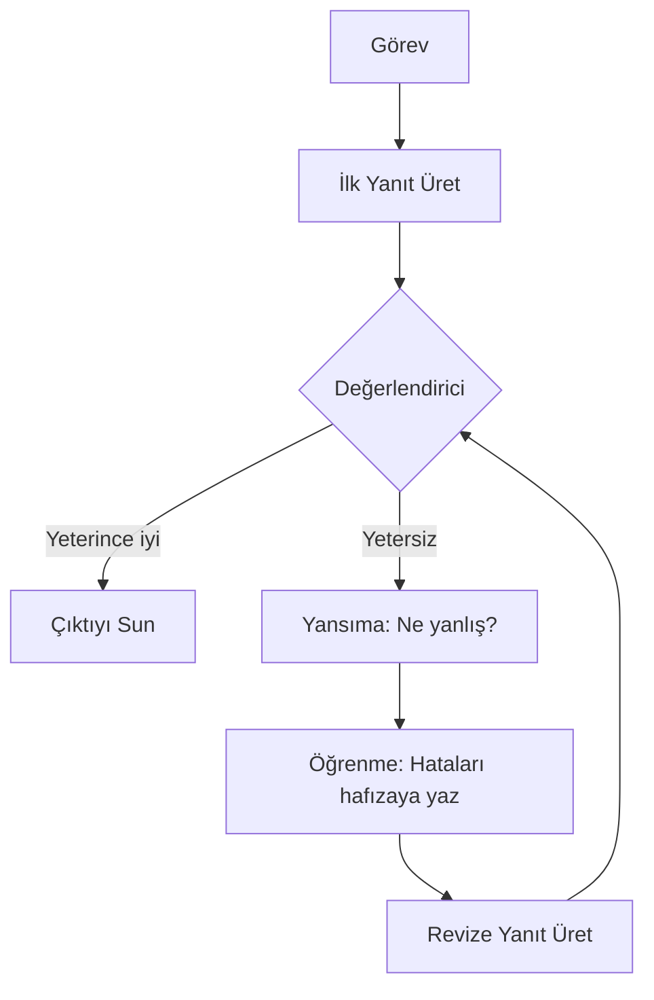

## TL;DR

Yansıma (reflection), bir agent'ın ürettiği çıktıyı kendi perspektifinden veya ayrı bir eleştirmen bileşeni aracılığıyla değerlendirip iyileştirmesidir. Reflexion deseni bu yaklaşımın akademik temelini oluşturur. Yansıma olmayan agent'lar ilk yanıtlarına körü körüne güvenir; yansıma sayesinde agent "yeterince iyi değil, tekrar deneyelim" diyebilir.

## Detaylı açıklama

İnsanlar önemli bir belge yazmadan önce taslak çıkarır, okur, düzeltir. Yansıma bu süreci LLM agent'ları için otomatikleştirir.

### Reflexion Deseni

**Reflexion** (Shinn et al., 2023), agent'a üç bellek katmanı ekler:

1. **Kısa vadeli:** Mevcut deneme
2. **Uzun vadeli:** Geçmiş denemelerin hatalarından çıkarılan dersler
3. **Değerlendirici (Evaluator):** Çıktının kalitesini ölçen fonksiyon veya LLM

Döngü:
- Görev → İlk deneme → Değerlendirme → Yansıma (ne yanlış gitti?) → Revize deneme → ...

### Yansıma türleri

**Öz-eleştiri (Self-Critique):** Aynı model kendi çıktısını eleştirir. Hızlıdır ama kör noktaları paylaşır.

**Çapraz eleştiri (Cross-Critique):** Farklı bir model veya agent eleştirmen rolünü üstlenir. Daha bağımsız; multi-agent sistemlerde kullanılır.

**Dışsal değerlendirme (External Evaluation):** Birim testleri, linter'lar veya kullanıcı geri bildirimi değerlendirici görevi görür. En güvenilir ama yavaş.

**Konuşma tabanlı yansıma (Conversational Reflection):** Kullanıcının geri bildirimi agent'ın bir sonraki denemeyi nasıl yapacağını şekillendirir.



<Callout type="info">
Kod yazma görevlerinde birim testleri mükemmel bir dışsal değerlendirici görevi görür. Test geçmiyorsa agent yansıma yapıp kodu düzeltir. Bu "test-driven agent" yaklaşımı, Claude Code ve OpenAI Codex gibi araçların çalışma biçimini yansıtır.
</Callout>

### Ne zaman durmalı?

Yansıma döngüsü sonsuz çalışabilir. Duruş kriterleri:
- Değerlendirici puanı eşiği aştığında
- Maksimum tur sayısına ulaşıldığında
- Ardışık iki deneme arasında anlamlı fark yoksa (convergence)
- İnsan onayı alındığında (human-in-the-loop)

## Minimal örnek

```python
from anthropic import Anthropic

client = Anthropic()

def reflect_and_improve(task: str, max_rounds: int = 3) -> str:
    draft = ""
    for round_num in range(max_rounds):
        if round_num == 0:
            prompt = f"Görev: {task}\n\nYanıtı oluştur."
        else:
            prompt = f"""Görev: {task}

Önceki taslak:
{draft}

Eleştiri: {critique}

Bu eleştiriyi göz önüne alarak daha iyi bir yanıt üret."""

        response = client.messages.create(
            model="claude-sonnet-4-5",
            max_tokens=1024,
            messages=[{"role": "user", "content": prompt}]
        )
        draft = response.content[0].text

        # Değerlendirici çağrısı
        eval_response = client.messages.create(
            model="claude-haiku-3-5",  # Ucuz model değerlendirici olarak
            max_tokens=256,
            messages=[{"role": "user", "content":
                f"Bu yanıtı değerlendir (1-10 puan ver ve eleştiri yaz):\n{draft}"}]
        )
        critique = eval_response.content[0].text
        if "9" in critique[:20] or "10" in critique[:20]:
            break  # Yeterince iyi
    return draft

result = reflect_and_improve("Python'da binary search algoritmasi yaz ve acikla.")
print(result)
```

## Gerçek dünya örneği

Bir içerik üretim agent'ı blog yazısı taslağı üretir. Yansıma döngüsü:

1. **Taslak:** İlk yazı üretilir
2. **Değerlendirme:** "SEO için anahtar kelimeler eksik, giriş bölümü çok uzun, kaynaklar yok"
3. **Yansıma:** Agent "SEO kriterlerini ve kaynak ekleme kurallarını öğrendim" notunu hafızaya yazar
4. **Revizyon:** Düzeltilmiş taslak üretilir
5. **İkinci değerlendirme:** "Okunabilirlik puanı 72, yeterince iyi" → döngü biter

Bu döngü sayesinde ilk denemede kabul edilemez kalitede olan içerik, 2-3 turda yayınlanabilir seviyeye gelir.

## Avantajlar / Sınırlamalar

| Avantaj | Sınırlama |
|---|---|
| Çıktı kalitesi ölçülebilir biçimde artar | Her tur ek token ve zaman maliyeti |
| Hataları otomatik tespit edip düzeltir | Kötü değerlendirici, kötü yansımaya yol açar |
| İnsan denetimini azaltır | Döngü yakınsayamazsa sonsuz tekrar riski |
| Öğrenilen dersler hafızada birikir | Aynı modelin kör noktaları öz-eleştiride tekrarlanır |
| Kod, yazı, plan gibi farklı çıktı türlerine uygulanabilir | Değerlendirme kriterleri açıkça tanımlanmamışsa etkisiz kalır |

## Ne zaman kullanılır / kullanılmaz

**Kullanılır:**
- Kalite kritik olduğunda ve birden fazla deneme yapılabiliyorsa
- Otomatik değerlendiricinin mevcut olduğu durumlarda (birim testleri, rubrikler)
- Uzun form içerik üretiminde (blog, rapor, kod modülleri)
- Agent'ın zamanla öğrenmesi ve iyileşmesi isteniyorsa

**Kullanılmaz:**
- Gecikme toleransı düşük gerçek zamanlı uygulamalarda
- Değerlendirme kriteri tanımlanamıyorsa
- Her deneme bağımsız ve öncekinden etkilenmemesi gerekiyorsa
- Maliyet kısıtı çok sıkıysa (her tur token ekler)

<Callout type="ipucu">
Değerlendiriciyi her zaman üretici modeliyle aynı modelde çalıştırmanıza gerek yok. Pahalı Opus ile üret, ucuz Haiku ile değerlendir; maliyet düşer, kapsam korunur.
</Callout>

## İlişkili kavramlar

- [Planlama (Planning)](/kavramlar/planning) — yansıma planlama döngüsünün kalite kontrol adımıdır
- [Hafıza (Memory)](/kavramlar/memory) — öğrenilen dersler uzun vadeli hafızaya yazılır
- [Çoklu Agent Sistemleri (Multi-Agent Systems)](/kavramlar/multi-agent-systems) — çapraz eleştiri için ayrı agent'lar kullanılabilir
- [İnsanlı Döngü (Human-in-the-Loop)](/kavramlar/human-in-the-loop) — değerlendirici yerine insan onayı

## Daha derine

- **Reflexion: Language Agents with Verbal Reinforcement Learning** (Shinn et al., 2023) — yansıma deseninin temel makalesi
- **Self-Refine: Iterative Refinement with Self-Feedback** (Madaan et al., 2023) — öz-geri bildirim ile iyileştirme
- **Constitutional AI** (Anthropic, 2022) — modelin kendi ilkelerine göre kendini denetlemesi
- **Critic: Large Language Model-based Task Interaction with External Feedback** (Gou et al., 2024)
- LangGraph'ta Reflexion uygulama kılavuzu (blog.langchain.dev)
