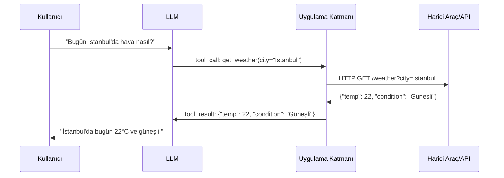

## TL;DR

Araç kullanımı (tool use), bir LLM'in yalnızca metin üretmek yerine harici dünya ile etkileşime geçmesini sağlar. Model, JSON formatında bir "araç çağrısı" üretir; çalışma ortamı bu çağrıyı gerçek bir fonksiyon olarak çalıştırır ve sonucu modele geri verir. Bu döngü, agent'ların hesap yapmasına, web araması yapmasına, dosya okumasına ve API'lara bağlanmasına olanak tanır.

## Detaylı açıklama

Büyük dil modelleri (Large Language Models — LLM) eğitim verisindeki bilgiyle sınırlıdır: güncel bilgiye erişemezler, hesap makinesi kullanamaz ve dış sistemlere yazamazlar. Araç kullanımı bu kısıtlamayı kaldıran köprüdür.

Teknik akış şu şekilde işler:

1. **Araç tanımı:** Geliştirici, LLM'e kullanabileceği araçları JSON şeması (JSON Schema) olarak tanımlar. Şema araçın adını, parametrelerini ve açıklamasını içerir.
2. **Model kararı:** LLM, kullanıcı mesajına ve mevcut araç listesine bakarak bir araç çağrısı mı yoksa doğrudan yanıt mı üreteceğine karar verir.
3. **Çağrı üretimi:** Model, yapılandırılmış JSON formatında bir araç çağrısı (tool call) üretir.
4. **Yürütme:** Uygulama katmanı bu çağrıyı alır, gerçek Python fonksiyonunu çalıştırır ve sonucu alır.
5. **Gözlem:** Sonuç modele "araç sonucu" (tool result) olarak geri verilir.
6. **Yanıt:** Model bu bilgiyle nihai yanıtı oluşturur.

Bu döngü, gerektiğinde birden fazla tur çalışabilir: model birden fazla araç çağırabilir, sonuçları değerlendirebilir ve tekrar araç kullanabilir.

<Callout type="info">
Araç kullanımı ile fonksiyon çağırma (function calling) çoğu zaman birbirinin yerine kullanılır. Teknik olarak "function calling" OpenAI'nın API terminolojisi, "tool use" ise Anthropic'in terminolojisidir; kavramsal olarak aynı mekanizmayı ifade ederler.
</Callout>



## Minimal örnek

```python
import anthropic
import json

client = anthropic.Anthropic()

tools = [
    {
        "name": "get_weather",
        "description": "Verilen şehir için güncel hava durumunu döner.",
        "input_schema": {
            "type": "object",
            "properties": {
                "city": {"type": "string", "description": "Şehir adı"}
            },
            "required": ["city"]
        }
    }
]

def get_weather(city: str) -> dict:
    # Gerçek uygulamada bir API çağrısı yapılır
    return {"city": city, "temp": 22, "condition": "Güneşli"}

response = client.messages.create(
    model="claude-sonnet-4-5",
    max_tokens=1024,
    tools=tools,
    messages=[{"role": "user", "content": "İstanbul'da hava nasıl?"}]
)

for block in response.content:
    if block.type == "tool_use":
        result = get_weather(**block.input)
        print(f"Araç sonucu: {result}")
```

## Gerçek dünya örneği

Bir müşteri destek agent'ı düşünün. Kullanıcı "Siparişim nerede?" diye sorduğunda:

1. Agent, `get_order_status(order_id="12345")` aracını çağırır.
2. Sipariş yönetim sistemi JSON yanıtı döner: `{"status": "kargoda", "estimated": "yarın 18:00"}`.
3. Agent bu bilgiyle samimi, bağlamsal bir yanıt oluşturur: "Siparişiniz kargoda ve yarın saat 18:00'e kadar teslim edilmesi bekleniyor."

Tek bir LLM çağrısıyla bu mümkün değildi; araç kullanımı canlı veri ile doğal dil yanıtını birleştirir.

## Avantajlar / Sınırlamalar

| Avantaj | Sınırlama |
|---|---|
| Modelin bilgi sınırını aşar, gerçek zamanlı veri sağlar | Her araç çağrısı ek gecikme (latency) ve maliyet ekler |
| Hesaplama, veritabanı, API gibi yetenekler kazandırır | Model yanlış araç veya yanlış parametrelerle çağrı yapabilir |
| Yapılandırılmış ve doğrulanabilir eylemler üretir | Araç tanımları iyi yazılmamışsa model kafası karışır |
| Deterministik hesaplamalar için LLM'e güvenmek gerekmez | Güvenlik: kötü niyetli girdiler araçlar üzerinden zarar verebilir |
| Birden fazla araç zincirlenerek karmaşık iş akışları oluşturulur | Çok sayıda araç context penceresini tüketir |

## Ne zaman kullanılır / kullanılmaz

**Kullanılır:**
- Güncel bilgiye erişim gerektiğinde (hava durumu, borsa, haberler)
- Hesaplama veya veri dönüşümü gereken durumlarda
- Harici sistemlere yazma/okuma işlemlerinde (CRM, veritabanı, dosya sistemi)
- Kullanıcıya doğrulanmış, güvenilir veri sunmak gerektiğinde

**Kullanılmaz:**
- Yalnızca metin üretimi yeterliyse (araç gereksiz yere gecikme ekler)
- Araçlar güvenlik açısından yeterince sıkı sınırlandırılamamışsa
- Düşük gecikmeli gerçek zamanlı uygulamalarda (her çağrı tur süresi ekler)
- Araç sonuçları belirsiz veya güvenilmezse (modeli yanıltabilir)

## İlişkili kavramlar

- [Fonksiyon Çağırma (Function Calling)](/kavramlar/function-calling) — araç kullanımının düşük seviye teknik uygulaması
- [MCP Protokol](/kavramlar/mcp-protokol) — araçları standart şekilde tanımlayan ve yayan protokol
- [Planlama (Planning)](/kavramlar/planning) — agent'ın hangi araçları hangi sırayla kullanacağına karar verme
- [Agent Orkestrasyonu (Agent Orchestration)](/kavramlar/agent-orchestration) — araç kullanan agent'ları koordine etme

## Daha derine

- Anthropic Tool Use dokümantasyonu (docs.anthropic.com)
- OpenAI Function Calling kılavuzu (platform.openai.com)
- **Toolformer** (Schick et al., 2023) — LLM'lerin araç kullanmayı kendi kendine öğrenmesi üzerine temel araştırma
- **ReAct: Synergizing Reasoning and Acting in Language Models** (Yao et al., 2022) — akıl yürütme ve araç kullanımını birleştiren desen
- **HuggingGPT / JARVIS** (Shen et al., 2023) — LLM'i karmaşık araç zincirleri için orkestratör olarak kullanan mimari
