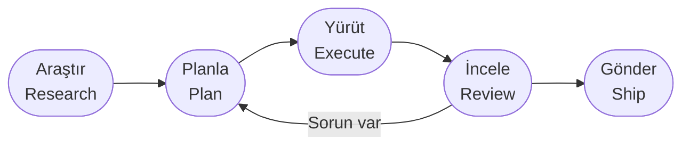

import Callout from '@components/mdx/Callout.astro';

## Bu Rehber Hakkında

Bu sayfa, topluluğun en kapsamlı Claude Code kaynaklarından biri olan
[shanraisshan/claude-code-best-practice](https://github.com/shanraisshan/claude-code-best-practice)
deposundaki bilgilerin Türkçeye uyarlanmış, derli toplu bir özetidir. Depo,
Claude Code kullanımını "vibe coding"den (sezgisel, plansız kodlama) yapılandırılmış
**agentic mühendisliğe** taşıyan ilkeleri; gerçek ekiplerin kullandığı geliştirme
iş akışlarını ve 83 toplam ipucunu kataloglar.

Buradaki amaç tek tek komutları ezberlemek değil; **bağlam yönetimi (context
management)**, **araç organizasyonu** ve **iş akışı orkestrasyonu** hakkında
yapılandırılmış düşünmektir. Doğrudan prompt yazmak yerine sistemli çalışmak,
büyük ölçekli kullanımda farkı yaratan şeydir.

<Callout type="not">
Claude Code hızlı evrilen bir araçtır; bu sayfadaki bazı özellikler (beta bayraklar,
komut isimleri) sürümle değişebilir. Güncel davranış için her zaman
[resmi dokümantasyonu](https://code.claude.com/docs) ve `/changelog`'u kontrol edin.
</Callout>

---

## Temel Primitive'ler

Claude Code'un tüm gücü, birbiriyle birleşen birkaç temel yapı taşına dayanır.
Bunları doğru kullanmak, ileri seviye iş akışlarının ön koşuludur.

| Primitive | Konum | Ne işe yarar |
|---|---|---|
| **Subagent** (alt-ajan) | `.claude/agents/<ad>.md` | Kendi bağlam penceresine sahip, özelleşmiş AI örneği |
| **Command** (komut) | `.claude/commands/<ad>.md` | Eğik çizgiyle (`/ad`) çağrılan, tekrar kullanılabilir iş akışı kısayolu |
| **Skill** (yetenek) | `.claude/skills/<ad>/SKILL.md` | Progressive disclosure ile yüklenen, `SKILL.md` ile tanımlı araç |
| **Workflow** (iş akışı) | — | Orkestre edilmiş `komut → ajan → skill` deseni |
| **Hook** (kanca) | `.claude/hooks/` | Olay tetiklemeli otomasyon (`PreToolUse`, `PostToolUse`, `Stop`) |
| **MCP Server** | `.mcp.json` | Model Context Protocol entegrasyonları |
| **Settings** | `.claude/settings.json` | İzinler, model seçimi, çıktı stili gibi yapılandırma |

### Skill tanımı (`SKILL.md` frontmatter)

- `name`, `description`, `argument-hint` — temel meta bilgiler.
- `disable-model-invocation: true` — otomatik tetiklenmeyi engeller (yalnızca elle çağrılır).
- `user-invocable: false` — eğik çizgi menüsünden gizler.
- `context: fork` — yürütmeyi bir alt-ajanda izole eder; ana bağlam yalnızca **sonucu** görür.

### Subagent tanımı (`.claude/agents/*.md` frontmatter)

- `tools`, `disallowedTools`, `model` — ajanın araç ve model kapsamını belirler.
- `skills:` — ajan başlatılırken bağlama önceden yüklenecek skill'ler.
- `isolation: "worktree"` — geçici bir git worktree içinde çalıştırır.
- Başka bir alt-ajanı **bash ile değil**, `Agent(subagent_type="...", prompt="...")` çağrısıyla tetikleyin.

### Yapılandırma hiyerarşisi (düşükten yükseğe öncelik)

```
Global varsayılanlar → Takım ayarları → Yerel override'lar → CLI argümanları → Yönetilen politikalar
```

<Callout type="ipucu">
**Kuralları davranış için değil, öneri için kullanın.** Deterministik olması gereken
politikaları (commit imzası, izinler, model zorlaması) `CLAUDE.md` yerine
`settings.json` ile uygulayın. `CLAUDE.md` öneri sunar; `settings.json` dayatır.
</Callout>

---

## Geliştirme İş Akışı Omurgası

Depo 13'ten fazla büyük metodolojiyi (Superpowers, Spec Kit, BMAD-METHOD,
HumanLayer, Compound Engineering vb.) inceliyor. Hepsinin ortak iskeleti aynı:



Öne çıkan örnekler:

- **Superpowers** — Git worktree'lerle alt-ajan güdümlü geliştirme; beyin fırtınası → planlama → çoklu inceleyici ajan → TDD → kod incelemesi.
- **Everything Claude Code** — 63 ajan, 121 komut, 300+ skill içeren dev bir ekosistem; Plan → TDD → kod incelemesi → güvenlik taraması → E2E → merge.
- **Matt Pocock Skills** — TDD odaklı; kırmızı/yeşil/refactor döngüleriyle çalışır.
- **Spec Kit** — Anayasa (constitution) → spesifikasyon → netleştirme → planlama → görev üretimi → uygulama → analiz.
- **gstack** — CEO/mühendislik/tasarım/DevEx çok aşamalı incelemeleriyle kurumsal ölçekli akış.
- **BMAD-METHOD** — Ürün özeti → PRFAQ → PRD → mimari → epik/story → geliştirme → kod incelemesi → QA → retrospektif.

<Callout type="info">
Bu deseni sitedeki [Workflow Desenleri](/workflow/desenler) sayfasındaki
Plan-and-Execute ve Manager-Worker pattern'larıyla birleştirebilirsiniz —
agentic mühendisliğin teorisi ve pratiği orada buluşur.
</Callout>

---

## 83 İpucu — Kategorilere Göre

Aşağıdaki ipuçları, başta Claude Code'un yaratıcısı Boris Cherny olmak üzere
Anthropic ekibinden ve topluluktan derlenmiştir.

### Prompting (Komut Yazma) — 3

- **"Bu değişikliklerin doğruluğunu bana kanıtla."** PR açmadan önce Claude'a çözümünün çalıştığını ispatlatın.
- Vasat bir düzeltmeden sonra: **"Artık her şeyi bildiğine göre, zarif (elegant) çözümü uygula."**
- Problemi doğrudan anlatın; hatayı yapıştırıp "düzelt" deyin. Uygulamayı mikro-yönetmeyin.

### Planlama / Spesifikasyon — 7

- Her zaman **plan modunda** başlayın.
- Gereksinim toplarken Claude'u ayrı bir oturumda **sizinle röportaj** yaptırın (AskUserQuestion).
- Birim, otomasyon ve entegrasyon testleri içeren **faz bazlı, kapılı (gated) planlar** kurun.
- Yatay fazlama yerine tüm katmanları kesen **dikey dilimler (vertical slices / tracer bullets)** uygulayın.
- Planı bir **staff engineer** gibi gözden geçirmesi için ikinci bir Claude örneği açın.
- Devretmeden önce **detaylı ve belirsizlikten arınmış** spesifikasyon yazın.
- Uzun PRD'ler yerine **20-30 prototip** iterasyonu yapın ("Prototype > PRD").

### Bağlam Yönetimi (Context Management) — 5

- 1M bağlamlı modellerde **bağlam çürümesi (context rot)** ~300-400k token civarında başlar.
- Performans ~%40 bağlam kullanımında düşer; hassas işlerde **%30'un altında** tutun.
- Başarısızlıktan sonra düzeltmeleri biriktirmek yerine **`/rewind` ile geri sarın** ("rewind beats correct").
- Bağlam limitinde otomatik sıkıştırma yerine **ipuçlu `/compact`** kullanın.
- Araç keşfini alt-ajanlara devredin; ara çıktılar çocukta kalır, yalnızca **sonuç** geri döner.

<Callout type="uyari">
**"Dumb zone" (aptal bölge):** Bağlam %40'ı aşınca model belirgin biçimde zayıflar.
Uzun oturumlarda erkenden temizlik yapmak, sonradan kafası karışmış bir modelle
boğuşmaktan daha ucuzdur.
</Callout>

### Oturum Yönetimi (Session Management) — 6

- Her turun bitişini bir **dallanma noktası** olarak görün: Devam / rewind / clear / compact / Subagent.
- Gerçekten farklı görevler için **yeni oturum** açın; ilişkili işlerde bağlamı yeniden kullanın.
- Geri sarmadan önce **"buradan itibaren özetle"** diyerek devir notu çıkarın.
- `/compact` (kayıplı, momentumu korur) ile `/clear` + kısa brief (kontrollü devir) arasındaki farkı bilin.
- Uzun süren işlerde **oturum özetlerini (recap)** kullanın; istemezseniz `/config`'ten kapatın.
- Önemli oturumları `/rename` ile adlandırın, sonra etiketle `/resume` edin; çoklu ajan çalıştırırken örnekleri etiketleyin.

### CLAUDE.md + Kurallar — 8

- Dosya başına **200 satırın altını** hedefleyin; 60 satırın daha iyi uyum sağladığı gözlenmiş.
- `.claude/rules/*.md` otomatik yüklenir; YAML frontmatter'daki `paths:` ile **yola göre tembel yükleme** yapın.
- Alana özel kuralları **`<important if="...">` etiketleriyle** sarın ki model görmezden gelmesin.
- Mono-repo'larda **birden çok CLAUDE.md** kullanın; ata/torun (ancestor/descendant) yükleme çalışır.
- Büyük talimatları **`.claude/rules/`** dizinine bölün.
- Claude'u başlatan herhangi bir geliştirici, **ilk denemede testleri** başarıyla koşabilmeli — koşamıyorsa CLAUDE.md eksiktir.
- Kod tabanını temiz tutun ve migration'ları bitirin; **yarım kalmış framework geçişleri** modelin desen seçimini bozar.
- Harness davranışını **`settings.json` ile** dayatın, `CLAUDE.md` ile değil.

### Ajanlar (Subagents) — 4

- Genel rollerden çok, **kendi bağlamına sahip özelleşmiş** alt-ajanlar oluşturun.
- Görevleri boşaltıp ana bağlamı temiz tutmak için **"use subagents"** deyin.
- Ajan takımlarını **tmux + git worktree** ile birleştirip paralel geliştirme yapın.
- Test-time compute için ayrı bağlam pencereleri kullanın: **bir ajan hata ararken diğeri doğrular.**

### Komutlar (Commands) — 3

- İş akışı uygulamasında alt-ajan yerine **komutları tercih edin.**
- Tekrarlayan günlük "inner-loop" görevleri için **slash komutları** yazıp git'e koyun.
- Sık yapılan işlemleri **skill veya komuta dönüştürün** ki tekrar tekrar prompt yazmayasınız.

### Skill'ler — 9

- Skill'i bir alt-ajanda izole etmek için **`context: fork`** kullanın; ana bağlam yalnızca sonucu görür.
- Skill'leri mono-repo'da **alt dizinlerle** organize edin.
- Skill'i `references/`, `scripts/`, `examples/` alt klasörleri içeren bir **klasör** olarak kurgulayın.
- Başarısızlık noktalarını belgeleyen bir **Gotchas (tuzaklar)** bölümü ekleyin.
- `description`'ı bir özet değil, bir **tetikleyici** olarak yazın: "ne zaman ateşlenmeliyim?"
- Bariz bilgiyi tekrarlamayın; **model davranışını değiştiren** kısma odaklanın.
- Adım adım talimat yerine **hedef ve kısıt** verin.
- Yeniden inşa yerine **kompozisyonu** sağlayan script ve kütüphaneler ekleyin.
- `SKILL.md` içine **`!komut`** gömerek dinamik shell çıktısını prompt'a enjekte edin.

### Hook'lar — 5

- Skill'lere **isteğe bağlı hook** koyun (örn. `/careful` yıkıcı komutları engeller).
- **PreToolUse** hook'larıyla skill kullanımını ölçüp az kullanılan araçları tespit edin.
- **PostToolUse** hook'larıyla otomatik formatlama yapıp CI hatalarını önleyin.
- İzin isteklerini bir **Opus örneğine** yönlendirip saldırı taraması + otomatik onay yaptırın.
- **Stop** hook'larıyla devam etmeyi veya işi doğrulamayı dürtükleyin.

### İş Akışları — 5

- Modeli stratejik seçin: **planlama için Opus, kodlama için Sonnet.**
- Karar şeffaflığı için **thinking modunu** ve **Explanatory** çıktı stilini açın.
- Yüksek efor gerektiren akıl yürütme için **`ultrathink`** anahtar kelimesini kullanın.
- Ara işi gizleyip yalnızca sonucu göstermek için **`/focus`** modunu açın.
- Opus 4.7 uyarlanabilir düşünmeyle **efor seviyesini** ayarlayın (low/medium/high/xhigh/max).

### İleri Teknikler — 9

- Mimariyi anlamak için **ASCII diyagramlarını** bolca kullanın.
- Yerel periyodik izleme için **`/loop`** (7 güne kadar) kullanın.
- Çevrimdışı çalışan bulut tabanlı periyodik görevler için **`/schedule`** kullanın.
- Otonom, uzun-soluklu görevler için **Ralph Wiggum** eklentisini kullanın.
- İzinleri joker (wildcard) sözdizimiyle yapılandırın (örn. `Bash(npm run *)`).
- **`/sandbox`** ile dosya/ağ izolasyonu yaparak izin sorularını **%84 azaltın.**
- **Ürün doğrulama (verification) becerinizi** mükemmelleştirmeye zaman ayırın.
- `dangerously-skip-permissions` yerine güvenli komut sınıflandırması yapan **auto mode** kullanın.
- E2E test + sadeleştirme + PR gönderimini birleştiren bir **`/go` skill'i** kurun.

### Git / PR Yönetimi — 5

- PR'ları **odaklı ve küçük** tutun (medyan: 141 PR'da 118 satır).
- Tüm PR'ları **squash merge** ile birleştirip temiz, doğrusal geçmiş ve kolay `git bisect` sağlayın.
- Görev biter bitmez, en az **saatte bir** commit atın.
- Akran PR'larında **@claude'u etiketleyip** tekrarlayan lint kuralları ürettirin.
- Hata ve regresyon yakalamak için **`/code-review`** ile çoklu-ajan analizi koşun.

### Hata Ayıklama (Debugging) — 6

- Takıldığınızda Claude'a **ekran görüntüsü** paylaşın; görsel bağlam çözümü hızlandırır.
- Tarayıcı incelemesi için **MCP araçlarını** kullanın (Claude in Chrome, Playwright, Chrome DevTools).
- Terminal oturumlarını **arka plan görevi** olarak çalıştırıp logları görünür kılın.
- Kurulum, kimlik doğrulama ve yapılandırma sorunları için **`/doctor`** çalıştırın.
- Çok perspektifli inceleme için **çapraz-model** yaklaşımı kullanın (örn. QA için Codex).
- Kod keşfinde vektör veritabanı yerine **agentic arama** (glob + grep) tercih edin.

### Yardımcı Araçlar (Utilities) — 5

- IDE yerine **iTerm / Ghostty / tmux** terminallerini kullanın; ajan entegrasyonu daha iyidir.
- **`/voice`** veya Wispr Flow ile sesli prompt yazıp verimliliği katlayın.
- Ajan geri bildirimi için **claude-code-hooks** kurun.
- Bağlam farkındalığı ve hızlı sıkıştırma için **status-line** eklentisini kurun.
- `settings.json` özelliklerini keşfedin (Plans Directory, Spinner Verbs gibi kişiselleştirmeler).

### Günlük Pratikler — 2

- Claude Code'u **her gün güncelleyin.**
- Oturum başında **changelog'u okuyun.**

---

## Skill ve Agent Koleksiyonları

Tekerleği yeniden icat etmeyin; topluluk binlerce hazır skill ve ajan derledi.

**Öne çıkan skill kütüphaneleri:**

- **Anthropic Skills** — resmî, 17 skill.
- **Matt Pocock Skills** — 25 skill, TDD odaklı.
- **wshobson/agents** — 156 skill.
- **awesome-agent-skills** — 1.424+ derlenmiş skill.
- **claude-skills** — 9 alanda 246 skill.

**Ajan koleksiyonları:**

- **Agency Agents** (msitarzewski) — 203 ajan.
- **awesome-claude-code-subagents** (VoltAgent) — 156 ajan.

<Callout type="ipucu">
Hazır bir koleksiyonu kopyalamadan önce kendi `CLAUDE.md` ve kurallarınıza uyup
uymadığını kontrol edin. Çok sayıda alakasız skill yüklemek, bağlam bütçenizi
gereksiz yere tüketir ve modelin doğru aracı seçmesini zorlaştırır.
</Callout>

---

## Çapraz-Model (Cross-Model) İş Akışları

Claude Code'u başka modellerle birlikte kullanmanın üç ana yolu vardır:

1. **Plugin sistemi** — Harici model CLI'ları (örn. OpenAI Codex plugin'i) doğrudan Claude Code içinde çalışır.
2. **MCP** — Claude Code, başka modelleri (Gemini, DeepSeek, Ollama vb.) **araç olarak** çağırır.
3. **Router yaklaşımı** — API uç noktası farklı bir sağlayıcıya yönlendirilir.

Tipik kullanım: Claude planlar ve kod yazar, **Codex bağımsız bir QA gözü** olarak
inceler. Bu konuyu derinleştirmek için bkz.
[Multi-Model Stratejileri](/workflow/multi-model-stratejileri).

---

## Hızlı Başvuru: Ne Zaman Ne Yapmalı?

| Durum | Öneri |
|---|---|
| Karmaşık göreve başlarken | Plan modu + ikinci Claude ile plan incelemesi |
| Bağlam %40'ı geçti | `/compact` (ipuçlu) veya alt-ajana devret |
| Bir deneme başarısız oldu | Düzeltme biriktirme; `/rewind` ile geri sar |
| Tekrarlayan günlük iş | Slash komutu veya skill'e dönüştür |
| Yıkıcı komut riski | `/sandbox` + `auto mode` |
| Çok katmanlı, paralel iş | Ajan takımı + tmux + git worktree |
| CI formatlama hataları | PostToolUse hook ile otomatik format |
| Kod tabanında arama | Agentic arama (glob + grep) |
| Tarayıcı/UI hatası | Ekran görüntüsü + MCP (Chrome/Playwright) |
| PR göndermeden önce | `/code-review` + "doğruluğu kanıtla" prompt'u |

---

## Kaynaklar

- [shanraisshan/claude-code-best-practice](https://github.com/shanraisshan/claude-code-best-practice) — Bu rehberin kaynağı (GitHub)
- [Karpathy'nin AI Kodlama İlkeleri](/workflow/karpathy-kodlama-ilkeleri) — 4 davranışsal ilke
- [Resmi Claude Code dokümantasyonu](https://code.claude.com/docs) — Anthropic
- [Claude Code (araç sayfası)](/araclar/claude-code) — Bu sitede
- [Modül 07: Claude Code ile Üretim](/modul/07-claude-code-uretim) — Adım adım eğitim
- [Workflow Desenleri](/workflow/desenler) — ReAct, Plan-Execute, Manager-Worker
- [Multi-Model Stratejileri](/workflow/multi-model-stratejileri) — Çapraz-model orkestrasyon
- [MCP Protokolü](/kavramlar/mcp-protokol) — Bu sitede
