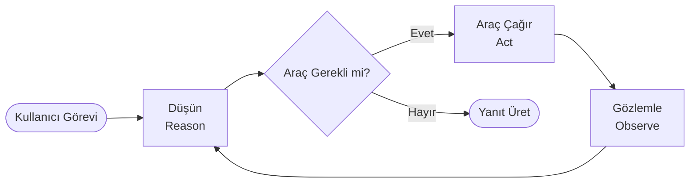
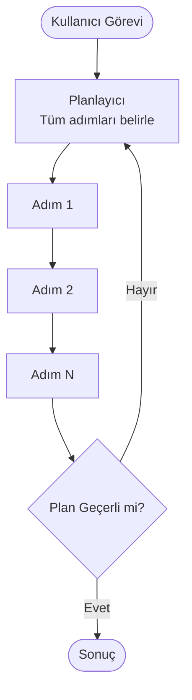
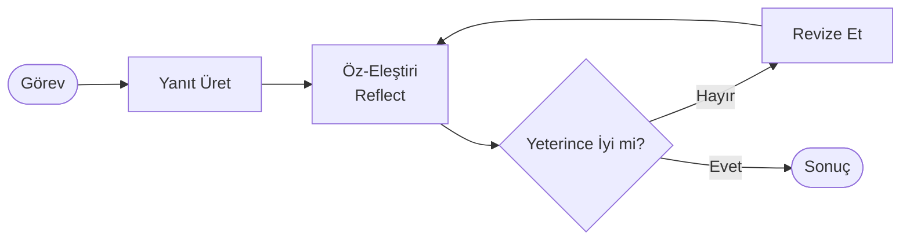
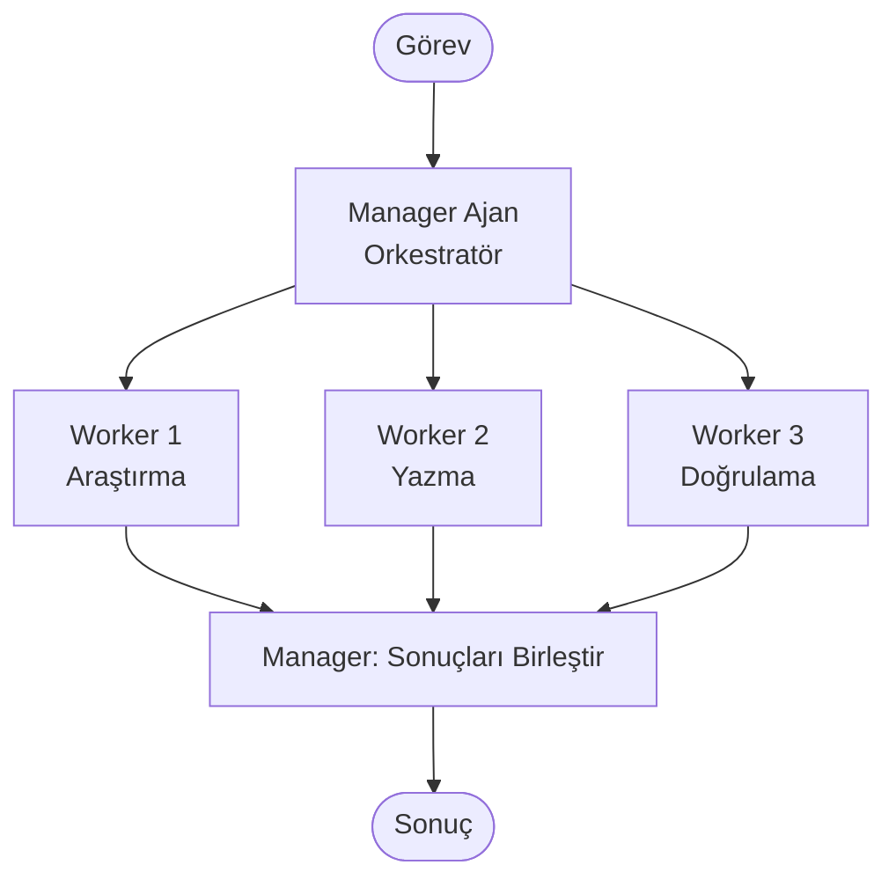
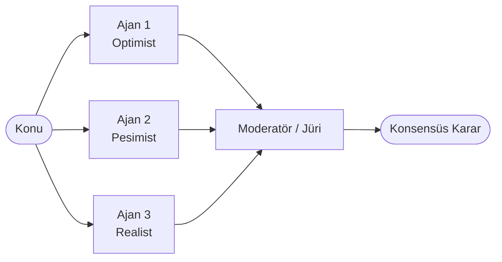
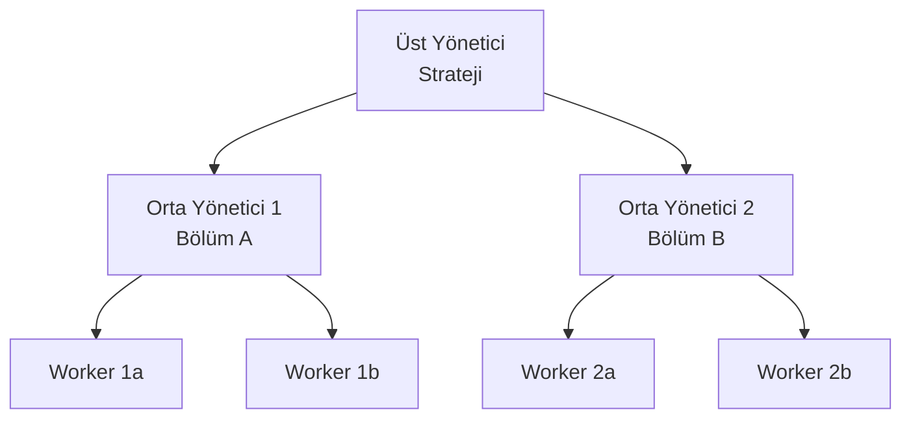
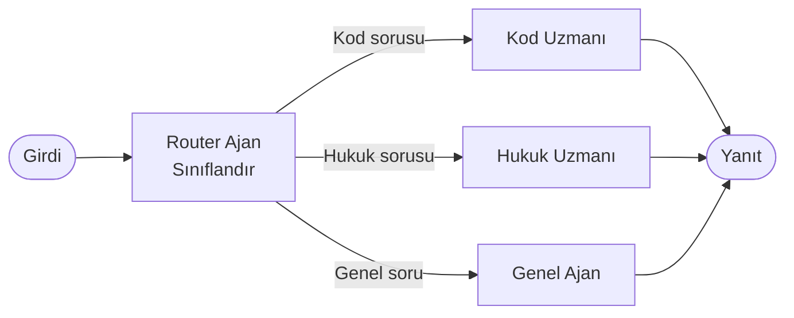
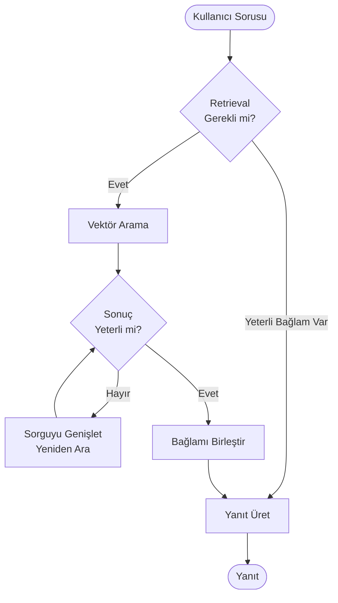
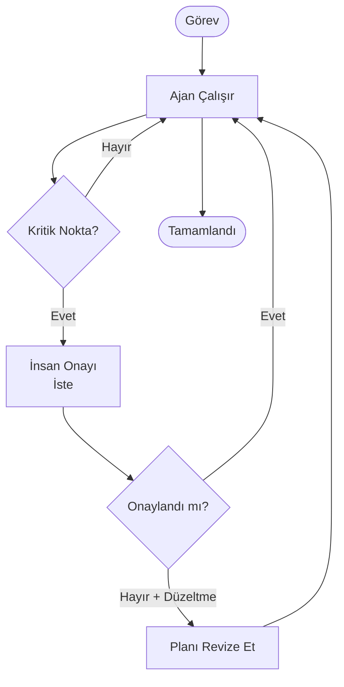
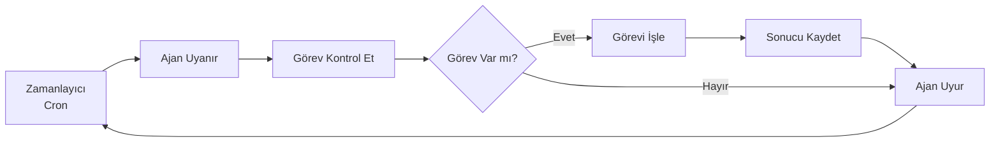

## Neden Desen Öğrenmelisiniz?

Her agentic sistem bir ya da birden fazla tasarım desenine (design pattern) dayanır. Desenleri bilmeden sistem kurmak, tekerleği yeniden icat etmek ve aynı hataları tekrar tekrar yapmak demektir. Bu sayfa 10 temel deseni; ne zaman kullanılır, ne zaman kullanılmaz ve hangi tuzaklara dikkat edilmeli — somut örneklerle açıklar.

---

## 1. ReAct (Reason + Act)

### Diyagram



### Ne Zaman Kullanılır?

- Görev, bilgi toplama ve eylem adımlarını dönüşümlü gerektiriyor.
- Arama, hesaplama veya API çağrısı gibi araçlar mevcut.
- Kaç adım gerektiği önceden bilinmiyor.

### Ne Zaman Kullanılmaz?

- Adımlar önceden belirli ve sabit ise (Plan-and-Execute daha iyi).
- Araç yok, sadece LLM çıktısı yeterliyse.

### Pseudocode

```
while görev tamamlanmadı:
    düşünce = llm.düşün(görev + geçmiş)
    if düşünce.araç_gerekli:
        sonuç = araç.çalıştır(düşünce.araç_çağrısı)
        geçmiş.ekle(sonuç)
    else:
        return llm.yanıt_üret(geçmiş)
```

### Canlı Örnek

```python
from anthropic import Anthropic

client = Anthropic()
araclar = [
    {
        "name": "web_ara",
        "description": "Web'de arama yapar",
        "input_schema": {
            "type": "object",
            "properties": {"sorgu": {"type": "string"}},
            "required": ["sorgu"]
        }
    }
]

mesajlar = [{"role": "user", "content": "LangGraph'ın son versiyonu ne?"}]

while True:
    yanit = client.messages.create(
        model="claude-sonnet-4-5",
        max_tokens=1024,
        tools=araclar,
        messages=mesajlar
    )
    if yanit.stop_reason == "end_turn":
        print(yanit.content[0].text)
        break
    # Araç çağrısını işle ve geçmişe ekle
    mesajlar.append({"role": "assistant", "content": yanit.content})
    # ... araç sonucunu ekle ve devam et
```

### Anti-Pattern Uyarisi

<Callout type="uyari">
Sonsuz döngü riski: ReAct'ta her adım bir öncekini bağlamında değerlendirmelidir. Maksimum adım sayısı (max_iterations) belirleyin; aksi hâlde hatalı araç çağrıları sonsuz döngüye girer ve maliyet patlar.
</Callout>

---

## 2. Plan-and-Execute

### Diyagram



### Ne Zaman Kullanılır?

- Görev karmaşık ama yapısı tahmin edilebilir.
- Alt görevler paralel çalıştırılabilir.
- Her adımın bağımsız doğrulanması gerekiyor.

### Ne Zaman Kullanılmaz?

- Görev keşif (exploratory) gerektiriyor; önceden plan yapmak mümkün değil.
- Dinamik ortam: her adım sonrası planın değişmesi gerekiyor (ReAct daha iyi).

### Pseudocode

```
plan = planlayıcı_llm.plan_oluştur(görev)
for adım in plan.adımlar:
    sonuç = yürütücü_ajan.çalıştır(adım)
    if not sonuç.başarılı:
        plan = planlayıcı_llm.planı_gözden_geçir(plan, sonuç)
return sonuçları_birleştir(tüm_sonuçlar)
```

### Canlı Örnek

```python
# LangGraph ile Plan-and-Execute
from langgraph.graph import StateGraph, END
from typing import TypedDict, List

class PlanState(TypedDict):
    gorev: str
    plan: List[str]
    tamamlanan: List[str]
    adim_index: int

def planlayici(state: PlanState):
    # LLM görevi alt adımlara böler
    adimlar = llm.invoke(f"Şu görevi adımlara böl: {state['gorev']}")
    return {"plan": adimlar.liste}

def yurutucu(state: PlanState):
    mevcut_adim = state["plan"][state["adim_index"]]
    sonuc = llm.invoke(mevcut_adim)
    return {
        "tamamlanan": state["tamamlanan"] + [sonuc],
        "adim_index": state["adim_index"] + 1
    }

def bitti_mi(state: PlanState):
    return "bitti" if state["adim_index"] >= len(state["plan"]) else "devam"

graph = StateGraph(PlanState)
graph.add_node("planlayici", planlayici)
graph.add_node("yurutucu", yurutucu)
graph.set_entry_point("planlayici")
graph.add_edge("planlayici", "yurutucu")
graph.add_conditional_edges("yurutucu", bitti_mi, {"bitti": END, "devam": "yurutucu"})
```

### Anti-Pattern Uyarisi

<Callout type="uyari">
"Kırılgan plan" riski: Planlayıcı mükemmel görünen ama gerçekte yanlış adımlar üretebilir. Her adımın çıktısını doğrulayan bir kontrol mekanizması ekleyin; körü körüne yürütmeyin.
</Callout>

---

## 3. Reflexion (Öz-Eleştiri Döngüsü)

### Diyagram



### Ne Zaman Kullanılır?

- Yüksek kalite çıktı gerekiyor (kod, rapor, analiz).
- İlk girişim neredeyse her zaman iyileştirilebilir.
- Harici doğrulama pahalı veya yavaş.

### Ne Zaman Kullanılmaz?

- Hız kritik; birden fazla LLM turu kabul edilemez.
- Görev nesnel değerlendirme gerektiriyor (insan değerlendirmesi yerine geçemez).

### Pseudocode

```
yanit = llm.üret(görev)
for tur in range(max_tur):
    eleştiri = llm.eleştir(görev, yanit)
    if eleştiri.yeterince_iyi:
        break
    yanit = llm.revize_et(yanit, eleştiri)
return yanit
```

### Canlı Örnek

```python
def reflexion_dongusu(gorev: str, max_tur: int = 3) -> str:
    yanit = llm.invoke(gorev)
    
    for _ in range(max_tur):
        elestiri_prompt = f"""
Görev: {gorev}
Mevcut yanıt: {yanit}

Bu yanıtı eleştir:
1. Neyi eksik veya yanlış?
2. Nasıl iyileştirilebilir?
3. Yeterince iyi mi? (evet/hayır)
"""
        elestiri = llm.invoke(elestiri_prompt)
        
        if "yeterince iyi: evet" in elestiri.lower():
            break
            
        revize_prompt = f"""
Orijinal görev: {gorev}
Mevcut yanıt: {yanit}
Eleştiri: {elestiri}

Eleştiriyi dikkate alarak yanıtı iyileştir:
"""
        yanit = llm.invoke(revize_prompt)
    
    return yanit
```

### Anti-Pattern Uyarisi

<Callout type="uyari">
"Sahte iyileştirme" riski: LLM her turda yanıtı değiştirebilir ama bu değişiklik gerçek iyileştirme olmayabilir. Nesnel kalite metriği (test geçme oranı, skor) kullanın; sadece LLM'in kendi değerlendirmesine güvenmeyin.
</Callout>

---

## 4. Manager-Worker (Orkestratör + Alt Ajanlar)

### Diyagram



### Ne Zaman Kullanılır?

- Görev paralel alt görevlere bölünebilir.
- Her alt görev farklı uzman gerektiriyor.
- Koordinasyon ve kalite kontrolü merkezi olmalı.

### Ne Zaman Kullanılmaz?

- Alt görevler birbirine sıkı bağımlı; paralel çalıştırılamaz.
- Basit görevler; overhead maliyetiyle orantısız.

### Pseudocode

```
manager.analiz_et(görev)
alt_görevler = manager.böl(görev)
sonuçlar = parallel.çalıştır([worker.çalıştır(ag) for ag in alt_görevler])
final = manager.birleştir(sonuçlar)
return final
```

### Canlı Örnek (CrewAI)

```python
from crewai import Agent, Task, Crew, Process

manager = Agent(
    role="Proje Yöneticisi",
    goal="Görevleri koordine et ve kaliteyi denetle",
    llm="claude-sonnet-4-5"
)

arastirmaci = Agent(role="Araştırmacı", goal="Kaynak bul ve özetle", llm="claude-haiku-4")
yazar = Agent(role="Yazar", goal="İçerik üret", llm="claude-sonnet-4-5")
kontrolcu = Agent(role="Editör", goal="Kalite kontrolü yap", llm="claude-haiku-4")

crew = Crew(
    agents=[manager, arastirmaci, yazar, kontrolcu],
    tasks=[arastirma_gorevi, yazma_gorevi, kontrol_gorevi],
    process=Process.hierarchical,
    manager_agent=manager
)
```

### Anti-Pattern Uyarisi

<Callout type="uyari">
Maliyet tuzağı: Manager dahil her ajan çağrısı = model maliyeti. 5 worker × 10 görev = 50+ LLM çağrısı. Worker'lara en ucuz yeterli modeli atayın (örn. lint görevi için Haiku). Ayrıntı: [Multi-Model Stratejileri](/workflow/multi-model-stratejileri).
</Callout>

---

## 5. Group Chat / Debate (Grup Tartışması)

### Diyagram



### Ne Zaman Kullanılır?

- Kararın birden fazla perspektiften değerlendirilmesi gerekiyor.
- Yanlı tek-ajan çıktısından kaçınmak istiyorsunuz.
- Yüksek riskli karar noktaları.

### Ne Zaman Kullanılmaz?

- Hız kritik; tartışma turları maliyetli.
- Nesnel doğru yanıtı olan görevler; tartışma yardımcı olmaz.

### Pseudocode

```
for tur in range(max_tur):
    for ajan in ajanlar:
        görüş = ajan.yorum_yap(konu, önceki_görüşler)
        görüşler.ekle(görüş)
    
    moderatör_özet = moderatör.özetle(görüşler)
    if moderatör.konsensüs_var(görüşler):
        break

return moderatör.karar_ver(görüşler)
```

### Anti-Pattern Uyarisi

<Callout type="uyari">
"Evet-adam" riski: Farklı rol verilen ajanlar aynı modelden üretiliyorsa gerçek perspektif çeşitliliği olmayabilir. Mümkünse farklı modeller veya farklı sistem promptları kullanın.
</Callout>

---

## 6. Hierarchical (Hiyerarşik)

### Diyagram



### Ne Zaman Kullanılır?

- Çok büyük ve karmaşık görevler; tek orchestratör yetersiz.
- Bölümler arası bağımsızlık yüksek.
- Büyük kurumsal süreç otomasyonu.

### Ne Zaman Kullanılmaz?

- Küçük-orta görevler; hiyerarşi overhead getirir.
- Takımlar arası sıkı koordinasyon gerekiyorsa; mesaj gecikmesi sorun.

### Anti-Pattern Uyarisi

<Callout type="uyari">
"Bürokrasi" riski: Her katman mesaj iletmek için LLM çağrısı yapar. 3 katman × 5 worker = çok sayıda çağrı. Hiyerarşiyi yalnızca gerçekten büyük sistemler için kullanın.
</Callout>

---

## 7. Router (Yönlendirici)

### Diyagram



### Ne Zaman Kullanılır?

- Farklı türde girdiler farklı uzmanlar gerektiriyor.
- Pahalı uzman ajanları yalnızca uygun görevlere yönlendirmek istiyorsunuz.
- Maliyet optimizasyonu: ucuz model sınıflandırır, pahalı model işler.

### Pseudocode

```
kategori = ucuz_model.sınıflandır(girdi)
ajan = ajan_haritası[kategori]
return ajan.işle(girdi)
```

### Canlı Örnek

```python
def router(girdi: str) -> str:
    # Ucuz model ile sınıflandır
    kategori = haiku.invoke(
        f"Şu soruyu sınıflandır (kod/hukuk/genel): {girdi}"
    )
    
    ajan_haritasi = {
        "kod": lambda g: opus.invoke(f"Kod sorusu: {g}"),
        "hukuk": lambda g: sonnet.invoke(f"Hukuk sorusu: {g}"),
        "genel": lambda g: haiku.invoke(f"Genel soru: {g}")
    }
    
    return ajan_haritasi.get(kategori, ajan_haritasi["genel"])(girdi)
```

### Anti-Pattern Uyarisi

<Callout type="uyari">
Yanlış sınıflandırma riski: Router modeli yanlış kategorize edebilir. Düşük güven skoru durumunda "genel" kategoriye düşüş veya insan onayı mekanizması ekleyin.
</Callout>

---

## 8. Agentic RAG (Dinamik Bilgi Erişimi)

### Diyagram



### Ne Zaman Kullanılır?

- Bilgi tabanı büyük ve dinamik.
- Hangi bilginin gerekli olduğu önceden bilinemiyor.
- Basit RAG yetersiz; çoklu arama turu gerekebilir.

### Ne Zaman Kullanılmaz?

- Bilgi tabanı küçük ve statik; basit RAG yeter.
- Gecikme (latency) kritik; birden fazla arama turu kabul edilemez.

### Anti-Pattern Uyarisi

<Callout type="uyari">
"Retrieval sarmalı" riski: Her arama daha fazla bağlam üretir, bu da yeni arama tetikler. Maksimum arama turu belirleyin ve bağlam penceresi yönetimini ihmal etmeyin. Bkz. [Model Context Management](/kavramlar/model-context-management).
</Callout>

---

## 9. Human-in-the-Loop (HITL) Checkpoint

### Diyagram



### Ne Zaman Kullanılır?

- Geri dönüşü zor kararlar (veri silme, ödeme, dağıtım).
- Regülasyonlu ortam; insan denetimi zorunlu.
- Düşük güven skoru senaryoları.

### Pseudocode (LangGraph interrupt)

```python
from langgraph.graph import StateGraph, END
from langgraph.checkpoint.memory import MemorySaver

def kritik_adim(state):
    # Kritik işlem öncesi interrupt
    return state

# Interrupt node olarak tanımla
graph.add_node("kritik_adim", kritik_adim)
graph.compile(
    checkpointer=MemorySaver(),
    interrupt_before=["kritik_adim"]  # Burada dur ve insan onayı bekle
)

# İnsan onayı sonrası devam ettir
app.invoke(None, config={"configurable": {"thread_id": "xyz"}})
```

### Anti-Pattern Uyarisi

<Callout type="uyari">
"HITL yorgunluğu" riski: Çok sık onay istenmesi kullanıcı kayıtsızlığına yol açar ("evet'e tıklama otomatiği"). Sadece gerçekten kritik noktalarda durdurun; rutin adımları otomatize edin.
</Callout>

---

## 10. Scheduled / Cron Agent (Zamanlanmış Ajan)

### Diyagram



### Ne Zaman Kullanılır?

- Düzenli aralıklarla çalışması gereken otonom görevler.
- İnsan tetiklemesi gerektirmeyen rutin süreçler.
- Uzun süreli, kesintisiz çalışma gerektiren görevler.

### Canlı Örnek

```python
import schedule
import time

def gunluk_ozet_gorevi():
    """Her gün 08:00'de çalışır"""
    # RSS beslemelerini çek
    haberler = rss_topla(beslemeler)
    
    # Ajan özet üretir
    ozet = llm.invoke(f"Şu haberleri özetle: {haberler}")
    
    # E-posta gönder
    email_gonder(alici="ekip@sirket.com", icerik=ozet)

schedule.every().day.at("08:00").do(gunluk_ozet_gorevi)

while True:
    schedule.run_pending()
    time.sleep(60)
```

### Anti-Pattern Uyarisi

<Callout type="uyari">
"Sessiz başarısızlık" riski: Zamanlanmış ajan kimse bakmadan hata verebilir. Hata durumunda alert/bildirim mekanizması zorunludur. Ayrıca günlük çalışan bir ajan × pahalı model = büyük aylık fatura; model seçimini dikkatli yapın.
</Callout>

---

## Desen Seçim Özeti

| Senaryo | Önerilen Desen |
|---|---|
| Araç kullanarak keşif görevi | ReAct |
| Karmaşık ama yapısı belli görev | Plan-and-Execute |
| Yüksek kalite çıktı, kalite kritik | Reflexion |
| Paralel uzman alt görevler | Manager-Worker |
| Çok perspektif gerektiren karar | Group Chat / Debate |
| Büyük, çok katmanlı organizasyon | Hierarchical |
| Farklı türde girdiler, maliyet optimizasyonu | Router |
| Dinamik bilgi erişimi | Agentic RAG |
| Geri dönüşü zor kritik kararlar | Human-in-the-Loop |
| Düzenli, otonom çalışma | Scheduled / Cron |

Daha fazla örnek için bkz. [Workflow Örnekleri](/workflow/ornekler) ve [Anti-Patternler](/workflow/anti-patternler).
