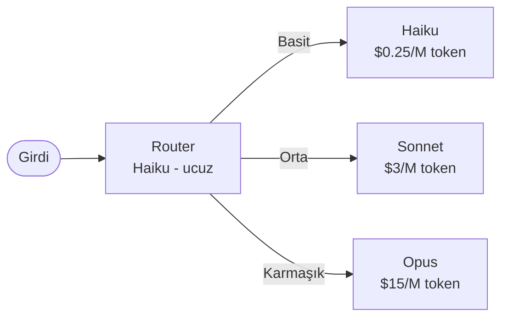
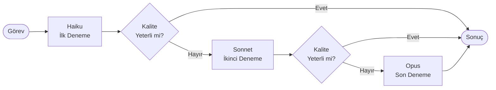
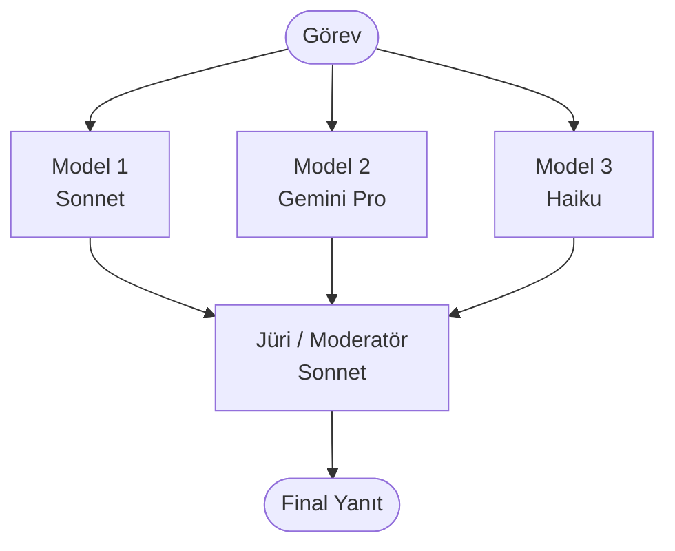
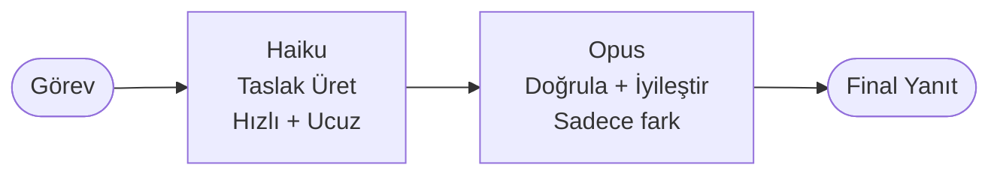

## Neden Multi-Model Strateji?

2026'da multi-agent sistemlerin en sık gözden kaçırılan maliyeti, model seçimidir. Her ajan çağrısında en güçlü modeli kullanmak, faturayı haftada 3 haneli Euro'ya kolayca taşıyabilir. Oysa görevlerin büyük çoğunluğu ucuz modeller tarafından karşılanabilir kalitede yapılabilir.

<Callout type="uyari">
Multi-agent sistemlerde her ajan-arası mesaj bir model çağrısıdır. 5 ajan × Opus seviyesi × 100 günlük çalışma = ciddi fatura. Bu sayfa bu sorunu sistematik biçimde çözer.
</Callout>

---

## Hangi Model Neyi İyi Yapar?

| Görev Türü | Haiku / Flash (Ucuz, Hızlı) | Sonnet / Pro (Orta) | Opus / Gemini Pro (Güçlü, Pahalı) |
|---|---|---|---|
| **Sınıflandırma** | Mükemmel | Fazla güçlü | Gereksiz |
| **Özet çıkarma** | Yeterli | İyi | Fazla güçlü |
| **Kod yazma (basit)** | Yeterli | İyi | Fazla güçlü |
| **Kod yazma (karmaşık)** | Yetersiz | İyi | En iyi |
| **Planlama** | Yetersiz | İyi | En iyi |
| **Uzun belge analizi** | Yetersiz (bağlam sınırlı) | İyi | En iyi |
| **Vision / görsel analiz** | Temel | İyi | En iyi |
| **Hız gerektiren görev** | En iyi | Yavaş | Çok yavaş |
| **Lint / format kontrolü** | Mükemmel | Fazla güçlü | Gereksiz |
| **Müzakere / empati** | Yetersiz | İyi | En iyi |
| **Türkçe dil kalitesi** | Orta | İyi | En iyi |
| **Matematik / akıl yürütme** | Zayıf | Orta | En iyi |

<Callout type="not">
Tablodaki kategoriler Mayıs 2026 modelleri için geçerlidir. Anthropic model ailesi: Haiku 4 (ucuz/hızlı) → Sonnet 4.5 (dengeli) → Opus 4 (en güçlü). Google: Flash → Pro → Gemini 3 Pro Ultra.
</Callout>

---

## Strateji 1: Router (Yönlendirici)

**Fikir:** Ucuz bir model görevi sınıflandırır, pahalı modele yalnızca uygun görevler gider.



```python
def router_stratejisi(girdi: str) -> str:
    # Haiku ile sınıflandır (~$0.0001 maliyet)
    siniflandirma = haiku.invoke(
        f"""Şu görevi sınıflandır. Sadece tek kelime yaz:
        - basit: özet, sınıflandırma, format dönüşümü
        - orta: kod yazma, analiz, çeviri
        - karmasik: uzun planlama, karmaşık mimari, araştırma
        
        Görev: {girdi}"""
    )
    
    model_secimi = {
        "basit": haiku,
        "orta": sonnet,
        "karmasik": opus
    }
    
    secilen_model = model_secimi.get(siniflandirma.strip(), sonnet)
    return secilen_model.invoke(girdi)
```

**Gerçek Maliyet Örneği — 1000 günlük görev:**

| Strateji | Ortalama model | Günlük maliyet | Aylık maliyet |
|---|---|---|---|
| Hepsi Opus | Opus | ~$15 | ~$450 |
| Router ile | Haiku %60 / Sonnet %35 / Opus %5 | ~$2.8 | ~$84 |
| **Tasarruf** | | **~%81** | **~$366** |

---

## Strateji 2: Cascading (Basamaklı Yükseltme)

**Fikir:** Önce ucuz modeli dene; başarısızsa bir üst seviyeye geç.



```python
def cascading_stratejisi(gorev: str, kalite_esigi: float = 0.8) -> str:
    modeller = [haiku, sonnet, opus]
    
    for model in modeller:
        yanit = model.invoke(gorev)
        
        # Kalite değerlendirmesi (basit heuristik veya başka bir LLM)
        kalite_skoru = kalite_degerlendirici(gorev, yanit)
        
        if kalite_skoru >= kalite_esigi:
            return yanit
        
        # Sonraki modele geç
    
    return yanit  # En az en güçlü modelin yanıtı döner

def kalite_degerlendirici(gorev: str, yanit: str) -> float:
    # Haiku ile hızlı kalite değerlendirmesi
    skor_yaniti = haiku.invoke(
        f"0.0-1.0 arası skor ver. Görev: {gorev}\nYanıt: {yanit}\nSadece sayı:"
    )
    return float(skor_yaniti.strip())
```

**Ne Zaman Kullanılır:**

- Görevlerin büyük çoğunluğu ucuz modelde çözülüyor ama bir alt kümesi güçlü model gerektiriyor.
- Kalite eşiğini önceden belirleyebiliyorsunuz.
- Gecikme (latency) ikincil öncelik; birden fazla deneme kabul edilebilir.

**Ne Zaman Kullanılmaz:**

- Tüm görevler güçlü model gerektiriyorsa (yalnızca ek gecikme maliyeti ödersiniz).
- Hız kritikse; her başarısız deneme zaman harcar.

---

## Strateji 3: Ensemble / Debate (Toplu Karar)

**Fikir:** Birden fazla model yanıt üretir; jüri (başka bir model veya oy çokluğu) kararı verir.



```python
def ensemble_stratejisi(gorev: str) -> str:
    # Paralel olarak farklı modellerden yanıt al
    import concurrent.futures
    
    modeller = [sonnet, gemini_pro, haiku]
    
    with concurrent.futures.ThreadPoolExecutor() as executor:
        yanitlar = list(executor.map(lambda m: m.invoke(gorev), modeller))
    
    # Jüri: en iyi yanıtı seç
    juri_prompt = f"""
Aynı göreve üç farklı yanıt var. En iyi yanıtı seç ve neden seçtiğini açıkla.

Görev: {gorev}

Yanıt 1: {yanitlar[0]}
Yanıt 2: {yanitlar[1]}
Yanıt 3: {yanitlar[2]}

En iyi yanıtı ver (mümkünse en iyilerini birleştir):
"""
    return sonnet.invoke(juri_prompt)
```

**Gerçek Maliyet Örneği:**

Ensemble en pahalı stratejidir. Tek bir görev için 3 model çağrısı + 1 jüri çağrısı = 4 toplam çağrı. Yalnızca sonucun yanlış olmasının maliyeti, 4x model maliyetinden yüksek olduğu durumlar için uygundur (tıbbi tavsiye, finansal karar, hukuki belge).

---

## Strateji 4: Speculative Execution (Spekülatif Yürütme)

**Fikir:** Ucuz model taslak üretir; pahalı model yalnızca doğrulama veya iyileştirme yapar.



```python
def speculative_stratejisi(gorev: str) -> str:
    # Adım 1: Ucuz modelle taslak
    taslak = haiku.invoke(f"Taslak oluştur: {gorev}")
    
    # Adım 2: Pahalı modelle yalnızca doğrulama
    dogrulama_prompt = f"""
Görevi tamamlamak için şu taslak üretildi.
Taslağı incele: hatalar varsa düzelt, eksikler varsa ekle.
Zaten doğruysa taslağı olduğu gibi döndür.

Görev: {gorev}
Taslak: {taslak}

Final yanıt:
"""
    return opus.invoke(dogrulama_prompt)
```

**Tasarruf Mekanizması:**

- Taslak üretimi: Haiku ile ~$0.25/M token
- Doğrulama: Opus ile ~$15/M token, ama girdi kısa (taslak + görev) ve çıktı genellikle minimal değişiklik
- Net tasarruf: Doğrudan Opus ile karşılaştırıldığında %40-60 maliyet düşüşü mümkün

---

## Gerçek Maliyet Karşılaştırması: Aynı Görev × 4 Strateji

**Senaryo:** Günde 500 kod inceleme (code review) görevi, ortalama 500 token girdi + 300 token çıktı.

| Strateji | Model dağılımı | Günlük token | Günlük maliyet | Aylık maliyet |
|---|---|---|---|---|
| **Tümü Opus** | 500x Opus | 400K token | ~$6.00 | ~$180 |
| **Router** | Haiku %70 / Sonnet %25 / Opus %5 | 400K token | ~$1.20 | ~$36 |
| **Cascading** | Haiku %65 / Sonnet %30 / Opus %5 | 450K token (yeniden denemeler) | ~$1.50 | ~$45 |
| **Speculative** | Haiku taslak + Opus doğrulama | 550K token | ~$2.80 | ~$84 |

<Callout type="ipucu">
Kod inceleme gibi rutin görevler için Router en uygun maliyetlidir. Sonucu yanlış olunca büyük hasar veren görevler (güvenlik açığı tespiti, üretim kodu dağıtımı) için Ensemble veya Speculative tercih edin.
</Callout>

---

## Subagent Başına Model Atama: Pratik Rehber

LangGraph veya CrewAI kullanıyorsanız her ajan için ayrı model tanımlayabilirsiniz:

```python
# LangGraph: Node başına model atama
from langchain_anthropic import ChatAnthropic

haiku = ChatAnthropic(model="claude-haiku-4")
sonnet = ChatAnthropic(model="claude-sonnet-4-5")
opus = ChatAnthropic(model="claude-opus-4")

def siniflandirma_node(state):
    # Ucuz görev → ucuz model
    return haiku.invoke(state["girdi"])

def analiz_node(state):
    # Orta karmaşıklık → orta model
    return sonnet.invoke(state["veri"])

def mimari_karar_node(state):
    # Kritik karar → güçlü model
    return opus.invoke(state["analiz"])
```

```python
# CrewAI: Agent başına model atama
from crewai import Agent

siniflandirici = Agent(
    role="Sınıflandırıcı",
    goal="Görevleri kategorize et",
    llm="claude-haiku-4"  # ucuz
)

analist = Agent(
    role="Analist",
    goal="Derinlemesine analiz yap",
    llm="claude-sonnet-4-5"  # dengeli
)

mimar = Agent(
    role="Sistem Mimarı",
    goal="Kritik mimari kararlar al",
    llm="claude-opus-4"  # güçlü
)
```

---

## Strateji Seçim Tablosu

| Durum | Önerilen Strateji |
|---|---|
| Görevler homojen ama önem düzeyi değişiyor | Router |
| Çoğu görev basit, az sayısı karmaşık | Cascading |
| Yanlış sonucun maliyeti çok yüksek | Ensemble |
| Rutin görevler ama kalite garantisi gerekli | Speculative |
| Tümü aynı karmaşıklıkta, basit | Tek model (Haiku) |
| Tümü aynı karmaşıklıkta, karmaşık | Tek model (Opus) |

---

## §1.7 ile Bağlantı: Maliyet Uyarısı

Site planının §1.7 bölümünde açıklandığı üzere, yanlış model seçimi haftalık 3 haneli Euro faturalar yaratıyor. Bu sayfada gösterilen 4 strateji, o maliyeti sistematik biçimde azaltmak için tasarlanmıştır.

Temel kural: Her ajan rolünü değerlendirin. "Hangi model bu görevi kabul edilebilir kalitede yapabilir?" sorusunu sorun; "En iyi sonuç hangi model verir?" sorusunu değil.

Daha fazla bağlam için bkz. [Model Context Management](/kavramlar/model-context-management) ve [Anti-Patternler](/workflow/anti-patternler).
