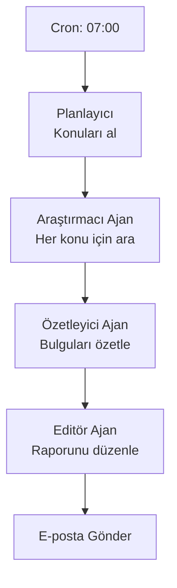
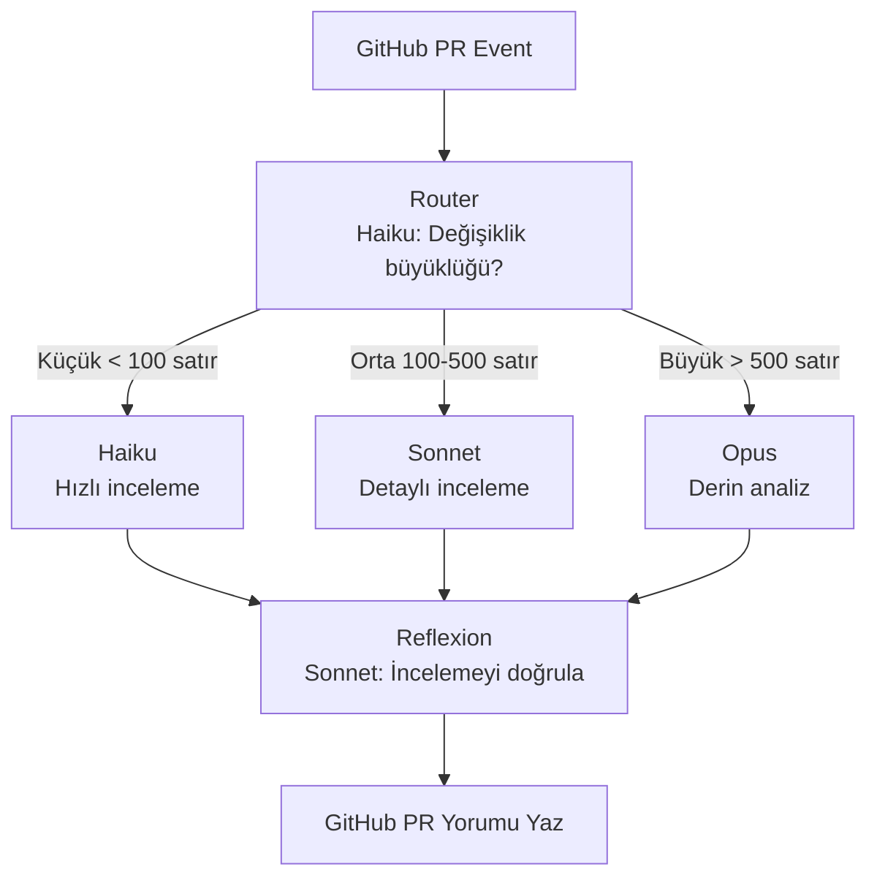
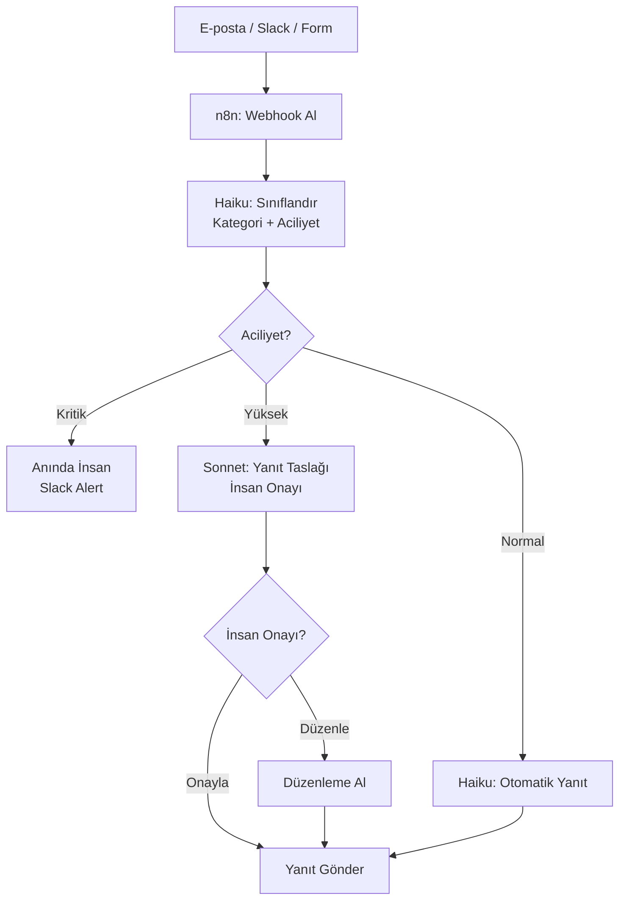
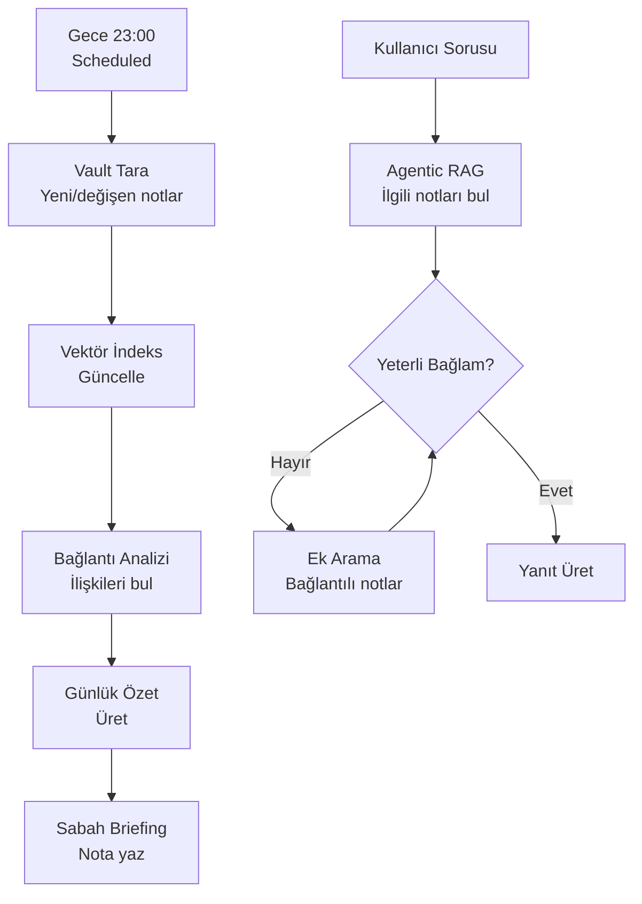

## Bu Sayfada Ne Bulacaksınız?

Teori yeterli değil. Bu sayfa dört gerçek hayat senaryosunu uçtan uca çözüyor: her örnekte hangi desen kullanıldığı, neden o tercih yapıldığı, tam kod ve dikkat edilmesi gereken noktalar yer alıyor.

---

## Örnek 1: Araştırma ve Özet Pipeline'ı

**Senaryo:** Her sabah belirlenen konularda web araştırması yapan, bulguları özetleyen ve e-posta ile raporlayan ajan.

**Kullanılan Desen:** Plan-and-Execute + Scheduled Agent

**Araçlar:** LangGraph, Claude Sonnet 4.5, Tavily Search API

### Mimari



### Tam Kod

```python
from langgraph.graph import StateGraph, END
from langchain_anthropic import ChatAnthropic
from langchain_community.tools.tavily_search import TavilySearchResults
from typing import TypedDict, List
import schedule
import time
import smtplib

# Model seçimi: özetleme Haiku, yazma Sonnet
haiku = ChatAnthropic(model="claude-haiku-4")
sonnet = ChatAnthropic(model="claude-sonnet-4-5")

arama_araci = TavilySearchResults(max_results=5)

class ArastirmaState(TypedDict):
    konular: List[str]
    arama_sonuclari: dict
    ozetler: dict
    final_rapor: str

def arastirma_node(state: ArastirmaState) -> ArastirmaState:
    """Her konu için web araması yapar"""
    sonuclar = {}
    for konu in state["konular"]:
        araştirma = arama_araci.invoke(konu)
        sonuclar[konu] = araştirma
    return {"arama_sonuclari": sonuclar}

def ozet_node(state: ArastirmaState) -> ArastirmaState:
    """Haiku ile her konuyu özetler — ucuz ve yeterli kalitede"""
    ozetler = {}
    for konu, sonuclar in state["arama_sonuclari"].items():
        prompt = f"Şu arama sonuçlarını 3-5 cümlede Türkçe özetle:\nKonu: {konu}\nSonuçlar: {sonuclar}"
        ozet = haiku.invoke(prompt)
        ozetler[konu] = ozet.content
    return {"ozetler": ozetler}

def rapor_node(state: ArastirmaState) -> ArastirmaState:
    """Sonnet ile profesyonel rapor oluşturur"""
    ozetler_metni = "\n\n".join(
        f"## {konu}\n{ozet}" 
        for konu, ozet in state["ozetler"].items()
    )
    
    rapor_prompt = f"""
Aşağıdaki araştırma özetlerinden profesyonel bir günlük bülten oluştur.
Başlık, öne çıkan 3 nokta ve konu detayları içersin.

{ozetler_metni}
"""
    rapor = sonnet.invoke(rapor_prompt)
    return {"final_rapor": rapor.content}

# Graf oluştur
graph = StateGraph(ArastirmaState)
graph.add_node("arastirma", arastirma_node)
graph.add_node("ozet", ozet_node)
graph.add_node("rapor", rapor_node)
graph.set_entry_point("arastirma")
graph.add_edge("arastirma", "ozet")
graph.add_edge("ozet", "rapor")
graph.add_edge("rapor", END)

app = graph.compile()

def gunluk_arastirma():
    sonuc = app.invoke({
        "konular": ["Agentic AI gelişmeleri", "LangGraph güncellemeleri", "MCP protokol haberleri"],
        "arama_sonuclari": {},
        "ozetler": {},
        "final_rapor": ""
    })
    # E-posta gönder
    raporu_gonder(sonuc["final_rapor"])

schedule.every().day.at("07:00").do(gunluk_arastirma)

while True:
    schedule.run_pending()
    time.sleep(60)
```

**Maliyet Notu:** Haiku özetleme + Sonnet rapor yazma kombinasyonu, tüm adımları Sonnet ile yapmanın yaklaşık %60 maliyetine gelir; kalite farkı ihmal edilebilir düzeyde.

---

## Örnek 2: Otomatik Kod İnceleme Sistemi

**Senaryo:** GitHub PR'larını otomatik inceleyen, güvenlik açığı, kod kalitesi ve stil sorunları bulan, öneriler üretip PR yorumu yazan ajan.

**Kullanılan Desen:** Router + Reflexion

**Araçlar:** Claude Agent SDK, GitHub MCP, Haiku + Opus

### Mimari



### Tam Kod

```python
import anthropic
import re

client = anthropic.Anthropic()

def pr_incele(pr_diff: str, pr_basligi: str) -> str:
    # Adım 1: Router — değişiklik büyüklüğünü belirle
    satir_sayisi = len(pr_diff.split("\n"))
    
    if satir_sayisi < 100:
        inceleme_modeli = "claude-haiku-4"
        derinlik = "hızlı"
    elif satir_sayisi < 500:
        inceleme_modeli = "claude-sonnet-4-5"
        derinlik = "detaylı"
    else:
        inceleme_modeli = "claude-opus-4"
        derinlik = "derin"
    
    # Adım 2: İnceleme
    inceleme_prompt = f"""
Şu kod değişikliğini {derinlik} biçimde incele:

PR Başlığı: {pr_basligi}

Değişiklikler:
{pr_diff}

Şunları kontrol et:
1. Güvenlik açıkları (SQL injection, XSS, vb.)
2. Hata işleme eksiklikleri
3. Performans sorunları
4. Kod tekrarı
5. Test eksiklikleri

Madde madde Türkçe listele:
"""
    
    inceleme_yaniti = client.messages.create(
        model=inceleme_modeli,
        max_tokens=2048,
        messages=[{"role": "user", "content": inceleme_prompt}]
    )
    inceleme = inceleme_yaniti.content[0].text
    
    # Adım 3: Reflexion — incelemeyi Sonnet ile doğrula
    dogrulama_prompt = f"""
Bir kod incelemesi yapıldı. Bu incelemeyi gözden geçir:
- Gereksiz yere sert veya yumuşak mı?
- Gözden kaçırılan kritik sorunlar var mı?
- Önerilerin uygulanabilir mi?

Orijinal değişiklikler:
{pr_diff[:2000]}  # İlk 2000 karakter

İnceleme:
{inceleme}

Gerekiyorsa düzeltilmiş incelemeyi ver, yoksa orijinalini onayla:
"""
    
    dogrulama_yaniti = client.messages.create(
        model="claude-sonnet-4-5",
        max_tokens=2048,
        messages=[{"role": "user", "content": dogrulama_prompt}]
    )
    
    return dogrulama_yaniti.content[0].text

# GitHub webhook handler (örnek)
def github_pr_handler(event_data: dict):
    pr_diff = event_data["diff"]
    pr_basligi = event_data["pull_request"]["title"]
    
    yorum = pr_incele(pr_diff, pr_basligi)
    
    # GitHub API ile PR'a yorum ekle
    github_yorum_ekle(
        repo=event_data["repository"]["full_name"],
        pr_number=event_data["pull_request"]["number"],
        yorum=yorum
    )
```

**Dikkat Edilecek Noktalar:**

- Büyük PR'lar (>500 satır) Opus kullanır; bu sefer büyük olduğu için maliyet haklıdır.
- Reflexion adımı Sonnet kullanır; küçük PR'larda bu adım maliyeti 2x eder. Eşiği dengelemeyi unutmayın.

---

## Örnek 3: Müşteri Destek Triajı ve Yönlendirme

**Senaryo:** Gelen destek taleplerini otomatik sınıflandıran, aciliyetini belirleyen, basit soruları kendisi yanıtlayan, karmaşık olanları doğru departmana yönlendiren ajan.

**Kullanılan Desen:** Router + Human-in-the-Loop + Manager-Worker

**Araçlar:** n8n (orkestrasyon), Claude API, Slack MCP

### Mimari



### n8n Workflow (JSON özeti)

```json
{
  "nodes": [
    {
      "name": "Webhook",
      "type": "n8n-nodes-base.webhook",
      "parameters": { "path": "destek-talebi" }
    },
    {
      "name": "Sınıflandır",
      "type": "@n8n/n8n-nodes-langchain.lmChatAnthropic",
      "parameters": {
        "model": "claude-haiku-4",
        "prompt": "Talebi sınıflandır: kategori (teknik/fatura/genel) ve aciliyet (kritik/yüksek/normal). JSON döndür."
      }
    },
    {
      "name": "Aciliyet Router",
      "type": "n8n-nodes-base.switch",
      "parameters": {
        "rules": [
          { "value": "kritik", "output": 0 },
          { "value": "yüksek", "output": 1 },
          { "value": "normal", "output": 2 }
        ]
      }
    },
    {
      "name": "Slack Alert (Kritik)",
      "type": "n8n-nodes-base.slack",
      "parameters": {
        "channel": "#destek-kritik",
        "message": "KRİTİK talep: {{$json.talep}}"
      }
    }
  ]
}
```

### Python Sınıflandırıcı (n8n Code Node)

```python
import anthropic
import json

def siniflandir(talep_metni: str) -> dict:
    client = anthropic.Anthropic()
    
    yanit = client.messages.create(
        model="claude-haiku-4",
        max_tokens=256,
        messages=[{
            "role": "user",
            "content": f"""Şu destek talebini sınıflandır ve JSON döndür:

Talep: {talep_metni}

Format:
{{
  "kategori": "teknik|fatura|genel|urun",
  "aciliyet": "kritik|yuksek|normal",
  "ozet": "tek cümle özet",
  "otomatik_yanit_mumkun": true|false
}}"""
        }]
    )
    
    return json.loads(yanit.content[0].text)
```

**Önemli Not:** Human-in-the-Loop adımı yalnızca "yüksek" aciliyet taleplerinde devreye girer. "Normal" talepler tamamen otomatik yanıtlanır. Bu denge, ekip verimliliğini korurken kritik taleplerin gözden kaçmamasını sağlar.

---

## Örnek 4: Kişisel Bilgi Yönetimi (PKM) Ajanı

**Senaryo:** Obsidian vault'unu indeksleyen, bağlantılar arası ilişkileri çıkaran, günlük özet üreten ve hafızaya yeni notlar yazan kişisel asistan ajan.

**Kullanılan Desen:** Agentic RAG + Reflexion + Scheduled Agent

**Araçlar:** Claude Code / Claude Agent SDK, Obsidian MCP, Haiku + Sonnet

### Mimari



### Tam Kod

```python
from anthropic import Anthropic
import os
import json
from datetime import datetime
from pathlib import Path

client = Anthropic()

def vault_ozet_uret(vault_yolu: str) -> str:
    """Obsidian vault'undaki notları okur ve günlük özet üretir"""
    bugun = datetime.now().strftime("%Y-%m-%d")
    
    # Son 7 günde değişen notları bul
    son_notlar = []
    for not_dosyasi in Path(vault_yolu).rglob("*.md"):
        if not_dosyasi.stat().st_mtime > (datetime.now().timestamp() - 7 * 86400):
            icerik = not_dosyasi.read_text(encoding="utf-8")
            son_notlar.append({"dosya": not_dosyasi.name, "icerik": icerik[:500]})
    
    if not son_notlar:
        return "Bu hafta yeni not yok."
    
    # Haiku ile hızlı özet
    ozet_prompt = f"""
Şu Obsidian notlarından bu haftanın öğrenme özetini çıkar:

{json.dumps(son_notlar, ensure_ascii=False, indent=2)}

Şunları içersin:
1. Ana temalar ve konular
2. Aralarındaki bağlantılar
3. Derinleştirilmesi gereken konular
4. Eylem öğeleri (action items)

Türkçe yaz:
"""
    
    ozet = client.messages.create(
        model="claude-haiku-4",
        max_tokens=1024,
        messages=[{"role": "user", "content": ozet_prompt}]
    )
    
    return ozet.content[0].text

def pkm_soru_yanit(soru: str, vault_yolu: str) -> str:
    """Vault'a dayanan Agentic RAG soru-yanıt"""
    
    # Adım 1: İlgili notları bul (keyword bazlı — production'da vektör arama kullanın)
    ilgili_notlar = []
    anahtar_kelimeler = soru.lower().split()
    
    for not_dosyasi in Path(vault_yolu).rglob("*.md"):
        icerik = not_dosyasi.read_text(encoding="utf-8").lower()
        if any(k in icerik for k in anahtar_kelimeler):
            ilgili_notlar.append({
                "dosya": not_dosyasi.name,
                "icerik": not_dosyasi.read_text(encoding="utf-8")[:1000]
            })
    
    if not ilgili_notlar:
        return "Vault'ta bu konuyla ilgili not bulunamadı."
    
    # Adım 2: Bağlam yeterli mi değerlendir
    bagiam_yeterli = len(ilgili_notlar) >= 2  # Basit heuristik
    
    # Adım 3: Yanıt üret
    yanit_prompt = f"""
Kişisel not vault'umu kullanarak şu soruyu yanıtla:

Soru: {soru}

İlgili notlar:
{json.dumps(ilgili_notlar[:5], ensure_ascii=False, indent=2)}

Notlarda bulunan bilgilere dayanarak yanıtla. 
Emin olmadığın yerlerde "notlarımda kesin bilgi yok" de.
"""
    
    yanit = client.messages.create(
        model="claude-sonnet-4-5",
        max_tokens=1024,
        messages=[{"role": "user", "content": yanit_prompt}]
    )
    
    return yanit.content[0].text

# Kullanım
if __name__ == "__main__":
    vault = os.path.expanduser("~/Documents/ObsidianVault")
    
    # Günlük özet
    ozet = vault_ozet_uret(vault)
    print("Bu Haftanın Özeti:")
    print(ozet)
    
    # Soru-yanıt
    yanit = pkm_soru_yanit("LangGraph checkpoint hakkında ne notum var?", vault)
    print("\nSoru-Yanıt:")
    print(yanit)
```

**Üretim Notları:**

- Keyword arama yerine gerçek vektör indeksi (ChromaDB, Qdrant) kullanın; ilgili sonuçlar çok daha iyi olur.
- Büyük vault'larda (1000+ not) tüm notları her gece taramak yerine delta bazlı indeks güncellemesi yapın.
- Bağlam penceresi yönetimi kritik: 50 notu tek seferde Sonnet'e vermek context sınırına çarpabilir. Bkz. [Model Context Management](/kavramlar/model-context-management).

<Callout type="ipucu">
Bu 4 örnek birleştirilebilir. Örnek 1'in araştırma pipeline'ı, Örnek 4'ün vault'una yazabilir. Örnek 3'ün destek triajı, Örnek 2'nin kod inceleme sistemini tetikleyebilir. Modüler yapı kurun.
</Callout>

---

## Sıradaki Adımlar

- Yaygın hataları öğrenmek için bkz. [Anti-Patternler](/workflow/anti-patternler)
- Temel desenlere geri dönmek için bkz. [Workflow Desenleri](/workflow/desenler)
- Maliyet optimizasyonu için bkz. [Multi-Model Stratejileri](/workflow/multi-model-stratejileri)
- Araç seçimine karar vermek için bkz. [Framework Seçim Rehberi](/karsilastirmalar/framework-secim-rehberi)
